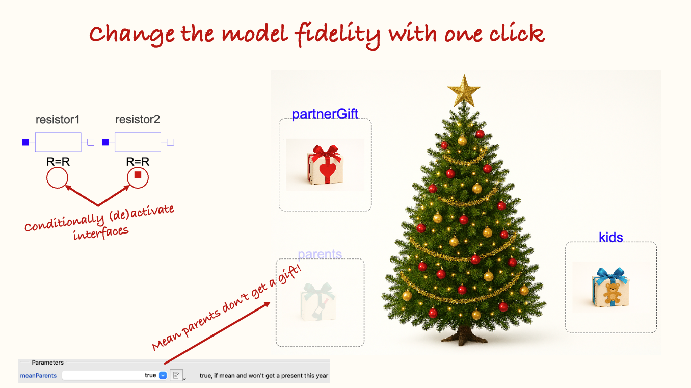
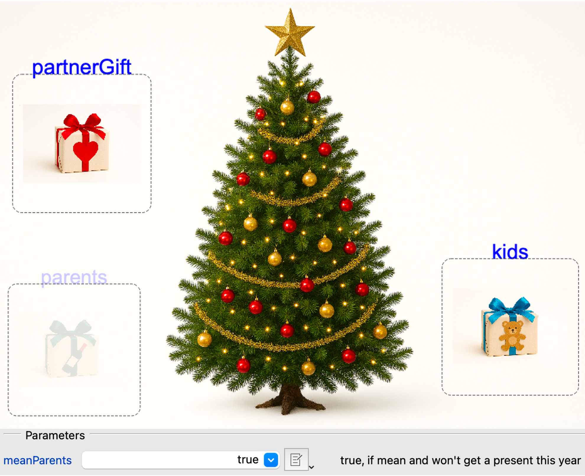
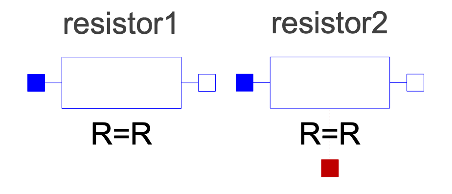

*I hope you've got your preferred drink in hand* ☕️🫖💧

📬 📰 **Saturday editions** - for having more time to read during the weekend! Let's experiment for a few weeks. Let me know if this is not a convenient day (❓).


In the [last article](./012-ReplaceableModels.qmd), we made sure that everyone could choose their preferred gift - only from a curated selection, tuned for each person.    
Yet, we all know that only well-behaved people get presents...

We did not consider this, so far! Let's correct that - and learn something new :)

## The mean way
If you understood the `replaceable` concept, you might realize that there is an easy - and yet mean way - to solve this issue.

I let you think about it for a second.

The second is over! And yes, you could just have an "empty" gift that `extends` from all receivers and then they could all get it!

```
model Empty
    extends .ModelicaNewsletter.Replaceable.Receivers.Partner;
    extends .ModelicaNewsletter.Replaceable.Receivers.Kids;
    extends .ModelicaNewsletter.Replaceable.Receivers.Parents;
end Empty;
```

However, that is really mean... you arrive, see the gift, open it, and find nothing!

Also, unless you know some tricks that we have not yet discussed, the person could still select another gift other than the "Empty" one - because choosing was the aim of our previous article.

📢 *If you know how to make sure that a person - let's say the parents - get the "Empty" gift, say how you would do it in a comment!* 👇

## The better way
What you really want is the possibility to just remove the entire gift from the Christmas tree, if someone was mean. We can do it!

In Modelica, there is the possibility to do "conditional instance". You know what an "instance" is. We covered it several times, and especially last week: it's when we "use a model" (drag&drop). Well, we can make this usage conditional. And based on the condition, the model can **not** be instantiated.

Let's see an example:

```
  1.  parameter Boolean meanParents = true "true, if mean and won't get a present this year";
  2.  replaceable .ModelicaNewsletter.Replaceable.Receivers.Parents parents if not meanParents "Your parents can choose their gift from the list" annotation(...);
```

I added some line numbers to explain:

1. First we introduced a Boolean parameter. This is a toggle between `true` and `false`. A Boolean cannot take any other value. So either you consider your parents were mean or not.
2. Then we only instantiated the gift "parents" `if not meanParents` - so basically if they were nice. 

And that's all. If the parents are not mean, then `not meanParents` is equal to "not false", which is `true`. Therefore, the present is instantiated.    
If the parents are mean, then `meanParents = true` and `(not meanParents) = false` and the present will not be instantiated.

> Note that we did not have to use the negation in the condition. We could have created the parameter as `niceParents` and have done the conditional instantiation as ` ... parents if niceParents` and we would have reached the same outcome. But we need drama to make a nice story so I keep the "mean Parents" here 😉

And as you can see in this screenshot, when the parents are mean, their gift is faded away, which means that it is not active.


## Is it useful in practice?
Yes! A lot! We all have mean people around us!    
Euhhh sorry, that was not what I wanted to say...

There are plenty of use cases, where we want this type of conditional instantiation. The more common one is for changing the level of fidelity when modeling physics. For example, consider an electrical resistor: it dissipates electrical power into heat (via the Joule losses). But are you always interested in modeling how this heat is evacuated?

### Conditional interfaces
No. Often you just want to look at the electrical variables and not the heat dissipation. So the heat port - named... `heatPort` - is conditionally instantiated so that you are not obliged to connect it to a thermal system.     
This is how part of the code looks like:

```
  parameter Boolean useHeatPort = false "= true, if heatPort is enabled" annotation(...);
  Modelica.Thermal.HeatTransfer.Interfaces.HeatPort_a heatPort(...) if useHeatPort "Conditional heat port" annotation(...);
```

And below are two instances of the same `Resistor` model. The one on the left has the Boolean `useHeatPort` set to `false`, and the one on the right set to `true`. And we see indeed the heat port in red on the right resistor.



There are similar cases all around `MSL` (the Modelica Standard Library). For example, most mechanical sources (e.g. `Modelica.Mechanics.Translational.Sources.Position`) have a conditional support connector to allow for having a relative source between components.

### Conditional models
Another use case where conditional instantiation is broadly used, is the creation of "container models". Let me explain this.

You are today designing a new healthcare imaging device that will allow detecting cancerous cells faster and with more accuracy. Of course you work at the best healthcare company: Siemens Healthineers 😉 (some free ads haha). Point is, you are designing a new electric drive that will move the imaging device with a given speed and position it with accuracy.    
Based on the step you are in the design, you might have different needs for your model:

- First: a rough model to understand the drive contributions to the overall system dynamics. This model might be technology-agnostic.
- Second: you select a given drive technology, and refine your model accordingly. The level of detail is still not really high.
- Third: you have a detailed design of your drive, and accordingly model detailed physical effects of the drive. This model is very detailed.
- Finally: you select the drive model from a supplier, and receive an FMU (see [the first article about FMI](./006-SpreadingWithFMI.qmd)) that includes the supplier model of the selected drive.
For all the above cases, you might want to easily switch between the different model fidelities.

Now if you followed well all along, you would be wondering: why should I not do that with a `replaceable model`. And you would be right! You could.    
The small note I will add - and that makes a big difference - is that this drive is not an isolated case: you actually have several components like that, that you want to switch fidelity **simultaneously**.

However, a `replaceable` model cannot be redeclared based on a parameter. So we cannot have a system-level parameter that would `redeclare` all the `replaceable` models to a given fidelity level.     
And that is when the conditional instantiation can play an important role.

If that is an interesting topic for you, you could have a look at section 3 of [Philip Jordan's paper](https://2014.international.conference.modelica.org/proceedings/html/submissions/ECP14096599_JordanSchmitz.pdf) - freely accessible.    
He explains this for an aircraft ECS library. (ECS stands for Environment Control System and, taking shortcuts, it's like an aircraft air conditioning.) He also shows the following compressor case, with four different "Detail Levels":


I did work with Philip - very nice guy 😉 -, and got inspired by the same structure to co-develop the Electric Power System library at Dassault Systèmes, together with Markus Andres and Marco Kessler. Just to point that this can be quite a useful model architecture.

## The END for today
Enough for today. I hope this showed you another way to work with model variants and you understood the main difference between `replaceable` and `conditional` models.    
If not, let me know what remains unclear, and I will try to explain this further.

*Break is over, go back to what you were doing.*

Clem


[Next](./about.qmd) ->