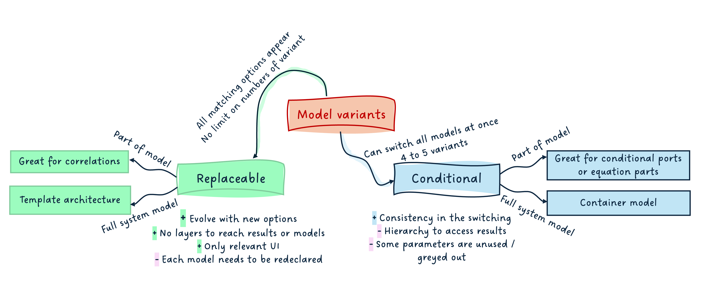
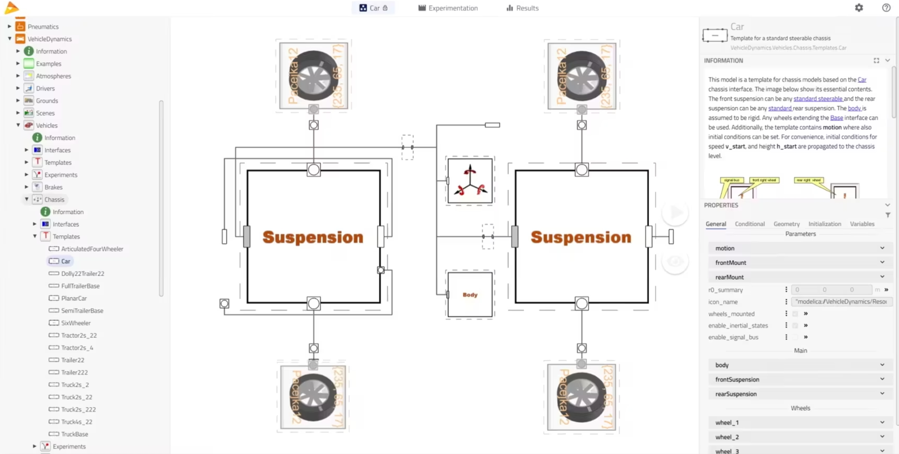
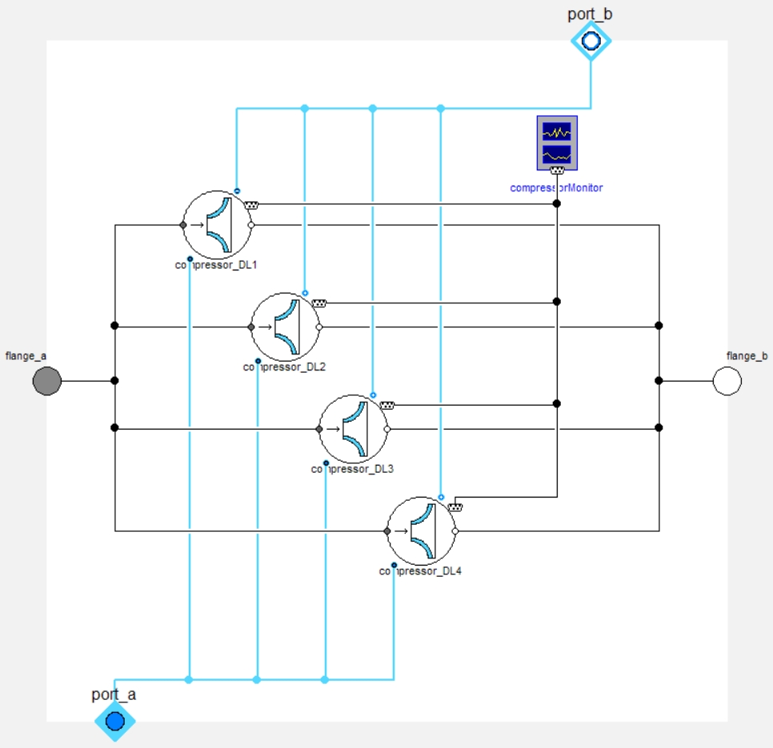
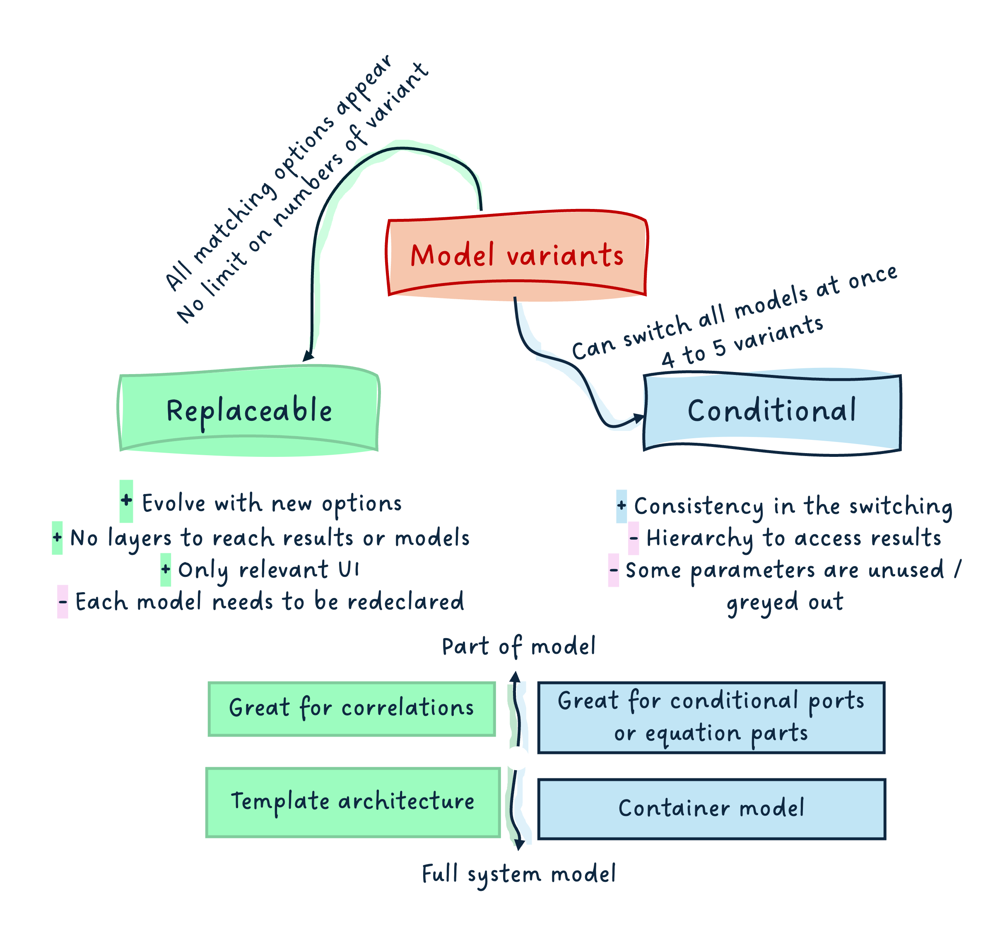

title: "A (technical) summary of model variants"
---

*I hope you've got your preferred drink in hand* ☕️🫖💧

📬 📰 **Saturday editions** - for having more time to read during the weekend! Let's experiment for a few weeks. Let me know if this is not a convenient day (❓).

We closed the year 2025 with a couple of articles that had a Christmas taste:

1. [Choosing your Christmas gifts!](./012-ReplaceableModels.qmd): we looked into the "replaceable models" concept in Modelica, and how it allowed for changing the model based on some constraints.
2. [Do you deserve a Christmas present?](./013-ConditionalModels.qmd): we saw that it was possible to make (part of the) models conditional, and that this could be used to build "container models" that allow for selecting a level fidelity consistently throughout several models, with one click.

What we are missing however is a trade-off between both solutions: when to use what.    
Sometimes, the information can get lost in the story wrapping, so this one might be more straight to the point.

I hope you had a great time off, by the way! I did 😊.   
Happy to be back with you though!

## An end-user perspective

Let's assume the models are well engineered...    
(And if you need help on how to engineer your models, reach out to me 😊)

### Replaceable models
When a replaceable model is used, the user can easily change the model variant to any matching choices, or a selection of these, usually with a drop-down menu. This means that if you develop a car model and are interested in defining the model for the tyres, you can easily choose between the existing tyre models.

From a user perspective, this is great because the end user can trust all options are listed and are potential matches for the subsystem to be modeled. The time to build a model can be greatly reduced. And the results seen after simulation only show the selected model, which is great - no "noise"!

It is however possible to perform this selection only one component at a time. This means that you would have to redo it for each tyre of your vehicle, which is inconvenient and could be error-prone - you might forget one.

### Container models
Now, if an entire library uses the container model approach, leveraging conditional components, then, with one click - a top-level parameter allowing to select the fidelity level -, the user can switch the fidelity of all components in their system model.

In our tyre case, this would allow for all tyre models to be switched at once. It could also allow for different fidelity levels to be established for the entire vehicle and all parts (e.g. tyres, suspensions, engine(s), etc.) to be switched to their e.g. "ideal" or "steady" or "detailed" fidelity level at once.

From a user perspective, this is also a great option, especially when the fidelity levels are common practices in the field of work, and it makes sense to study these over the development cycle. Changing only in one place the fidelity level of all components is highly valuable.    
However, this adds an additional level of hierarchy due to the container models. This can be annoying to navigate to the results and seems a bit more "messy/noisy".

## A library developer perspective

I have been developing libraries for more than 10 years - either in the industry or as software vendor. There is one funny thing to say there: a library that is great for the developer can be pretty horrible for the end user.    
The library developer loves when the library is simple to maintain. It means often: DRY KISS... Don't Repeat Yourself, Keep It Simple, Stupid.    
And "Simple, Stupid" are quite subjective!

These mindsets can often lead to poor end user experience. For example, DRY can lead to a lot of inheritance[^1] to avoid code repetition, and KISS can be interpreted as keeping the maintenance simple, which can also lead to less overhead for the developer when a change is needed, at the expense of the library usability.

I got distracted... yet I am saying that because this is the developer perspective. Let me get back to our topic!

[^1]: We covered the meaning of the word "inheritance" in article [012](./012-ReplaceableModels.qmd).

### Replaceable models

For the library developers, replaceable models require their share of model architecting:

- the interfaces need to be clearly defined and base classes identified,
- if there are different levels of constraints, these should be identified too, so they can be extended by the right model,
- all models extending the base classes shall be correctly identified,
- it makes sense to build "templates" model of your system, with the replaceable models connected together.

> Note: these are all best practices so it is not really a constraint. However, if you do not have all this information before starting the development, it might mean that at some point, you'll need some severe restructuring of your code to make this work fine.

The great thing, however, is that there is no limit of models that can match the constraint. And this number does not need to be known. This means that if you start your library and have 4 model variants to your tyres and develop two new ones, as long as they can extend the same base classes, they will fit in the overall framework and appear as candidates to be redeclared!    
And one nice thing is that only the parameters relevant to a model will appear once the variant is selected.

This all makes it very convenient for having replaceable correlations (e.g. friction in pipes), where the number of correlations is usually as many as the number of books on the topic... or more! And you do not need the full template architecture.

### Container conditional models

For the library developers again, container conditional models only make sense when:

- there is a known finite number of cases to cover,
- there is consistency in these cases between most models of the library,
- there is the need to switch the fidelity level at top level - all models at once.

The developer has to think much less about each model variant "compatibility" - only the interfaces need to match. However, this concept brings a lot of work on the user interface (parameters' management) because the container will have to display - potentially greyed out - all parameters for all variants. It becomes also very hard to read the container class, as soon as more than ~ 4 or 5 model variants exist in it.

Conditional models, without the container approach, are much simpler and thus often used, e.g. for the conditional port, like the heat port.     They also offer the great advantage that `connect` statements are automatically removed if a component is conditionally removed. (So you don't end up with "lost connections".)

## Summary

Here is a short summary mind map:

I hope it summarizes well all the points covered in this and the two past articles on the topic.

If you have more thoughts to it, let me know and I will update it.    
All contributions are welcome.

## The END for today
Enough for today. I hope this closes a topic that was left open during the break. I am sure it did not prevent you from sleeping though...

Suspense for the next article... a few topics are in the pipeline!     
Yet, don't hesitate to reach out with ideas.

Maybe it is time for an FMI article again!

*Break is over, go back to what you were doing.*

Clem

[Next](./015-ModelUsage.qmd) ->