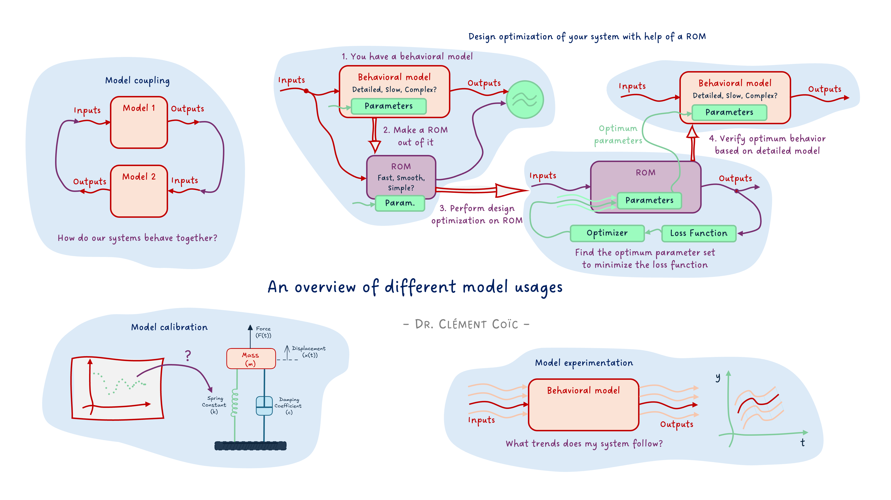
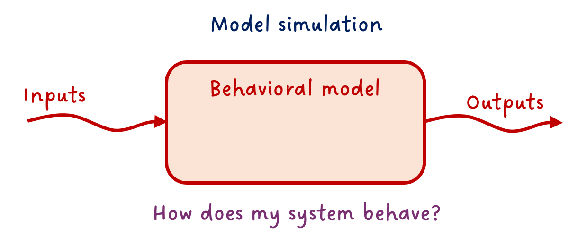
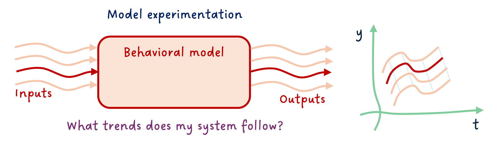
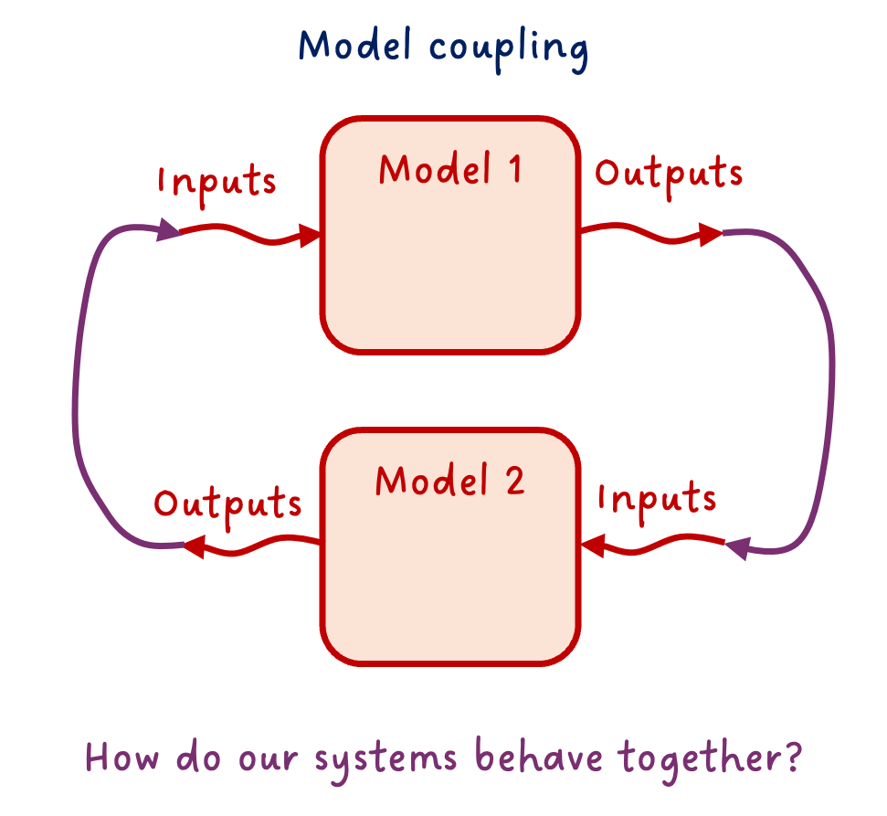
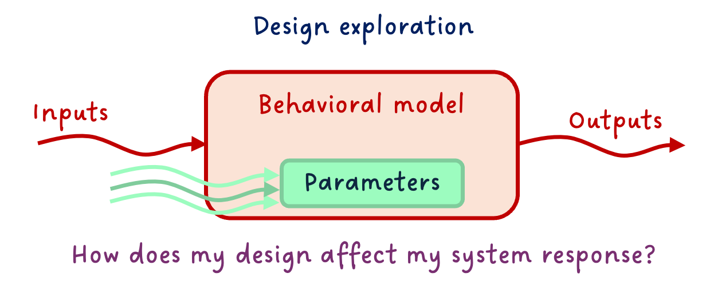
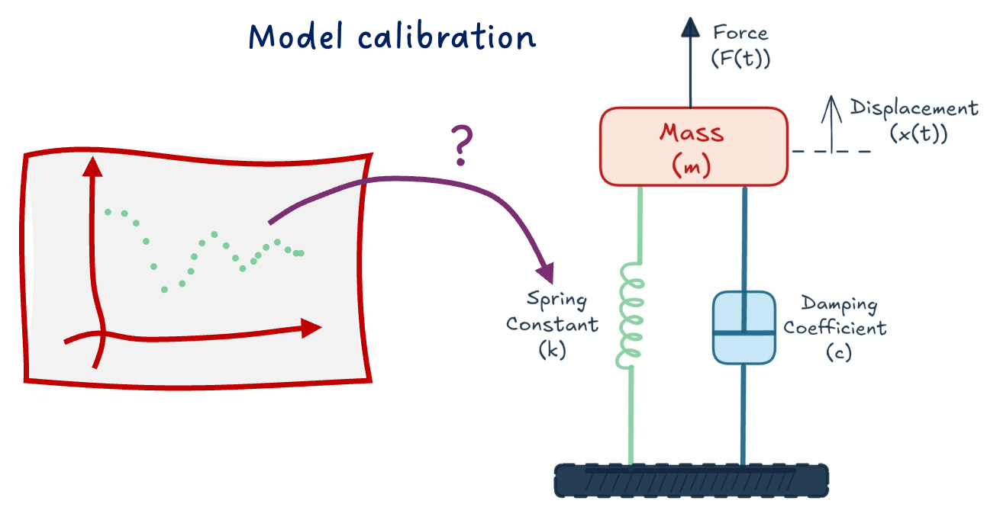
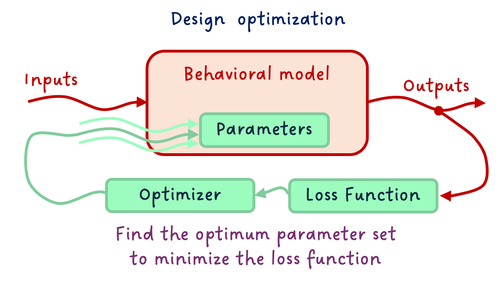
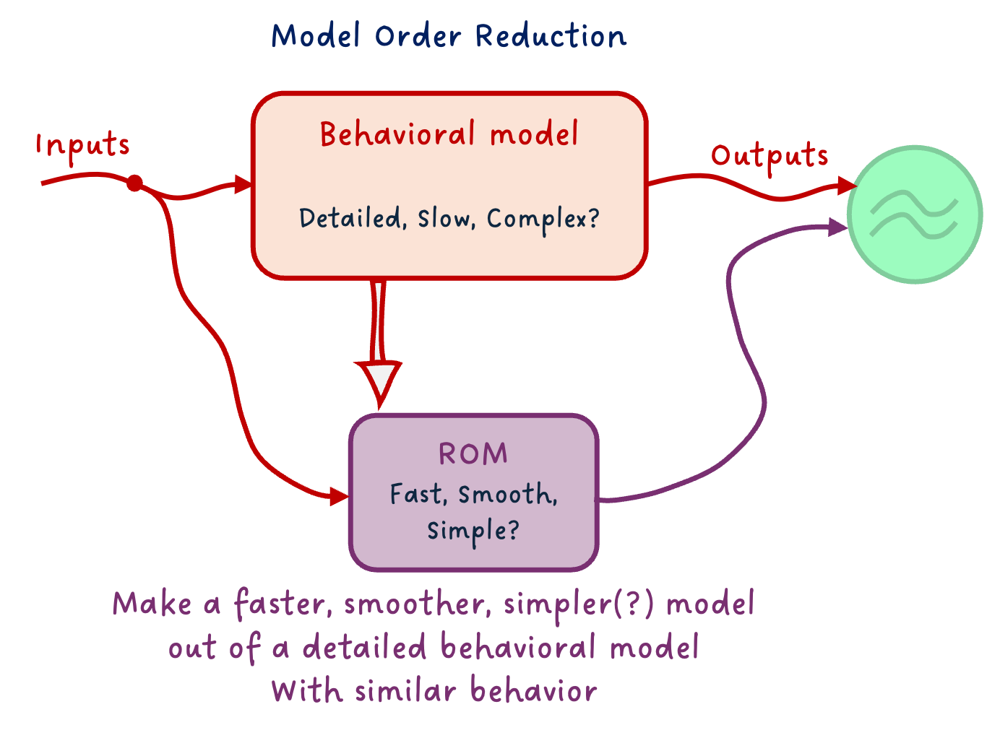
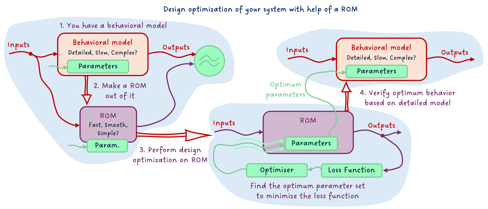

*I hope you've got your preferred drink in hand* ☕️🫖💧

📬 📰 **Saturday editions** - for having more time to read during the weekend! Let's experiment for a few weeks. Let me know if this is not a convenient day (❓).

Today, I want us to set the ground for the series of articles on FMI that are coming. And for that, we will discuss the different uses of models.

Now, before I explain further, let me say clearly: we won't cover neither ALL model usages nor all model types. The scope is still behavioral models, and we will discuss the main types of usages. There are more, and if there is one you are using a lot that I don't list here, please add it in a comment! 👇     
Back to the topic.

So what do we do with our models? And I am not saying "why" we create the model in the first place - though this is also a very good question we should answer before doing a model, and this was covered in [our first model](./003-FirstModel.qmd) article. Yet to achieve our engineering goal, we might leverage our model in different ways. This is what I want to discuss today.

Let's dive in.

## Basic workflows
Let's see first the most typical workflows before getting into more complex ones.

### The obvious: model simulation
The most straightforward thing to do with a functioning model is to simulate it.
The point of model simulation is to provide the inputs to your model and study the outputs.
You basically want to answer the question: how does my system behave under these inputs.

This is straightforward. And let's state the second obvious one.

### More simulation: model experimentation
Because often inputs are not unique, we can start experimenting on these, and answer "What if..." scenarios.    
_What_ would be the airplane change of attitude _if_ the pilot steers the command in a given manner?    
_What_ is the viscosity of the oil in the hydraulic system of an aircraft at -30°C, and how does that affect the flight control performance?

⚠️ You can only ask questions the model is made for answering. Again, I want to point at [our first model](./003-FirstModel.qmd) article, where we discussed that one of the first things to do is to know what we want our model to do and develop it accordingly. When using it, we need to stay within this "experimental frame" - I believe the term was coined by B.P. Zeigler around 1976 (maybe I am wrong).

### More more simulation: model coupling
You might know about the double-Vee model, else read [my post](https://www.linkedin.com/feed/update/urn:li:activity:7267442888853065728/) about it 😊.
Why I am bringing this topic is that it is a standard engineering workflow to decompose the system into subsystems. And each subsystem, potentially into sub-subsystems, ... and finally into components. At the right subsystem levels, the engineering team will develop models, prior to physical prototypes. Very often, there is a need for these models - coming from different teams, most likely different tools - to be coupled.

Your flight control model, that includes the hydraulic system with actuators, might need to be coupled with the aircraft dynamics model, for example.

This is just an example. The coupling is obviously not necessarily only between two models. It is often the case that many subsystems are coupled and interact all together (multiple connections).

And there is a specific case of the coupling that is worth mentioning: the controller-plant coupling. Often the model of the physical system is called "plant model", and its controller is in a separate model. Coupling both to design the controller and study the closed-loop system performance is key in system dynamics studies.

## More advanced workflows
We covered some of the usual suspects. There are more. They are also common, and yet require more advanced techniques, often done with scripting in Python or another language or using dedicated software.

### Design exploration
So far, we assumed the model was complete and correct. You might know the stroke of your actuator is 120mm, for example. However, don't you remember that every design has tolerances? For sure you do. 😊 It is however simpler to forget about these parameter variations. 😅 Here, we won't! 😉

So one very important practice is to test your model response over the range of possible variations of the main parameters. It is kind of the same as "model experimentation" above, but this time we vary the parameter values instead of the inputs. (Well, we might also vary the inputs.)

This can often lead to a huge amount of simulations, so make sure to focus on the main parameters. Also, one typical mistake is to change the value in a "hard-coded" fashion, and forget to put it back to its default value after the design exploration. When possible, make your design exploration "aside" from your main model (e.g. extending the main model and modifying parameters, or experimenting on an FMU, etc.) - this will save you a lot of debugging later. (Trust me... 😅)

### Model calibration
You might not know all parameters of your model, and yet, you might have some data about your system behavior. You can use the data to calibrate the unknown parameters.    

What is the value of the stiffness of the spring knowing the data from the field tests show this response?

There are many ways to do so, from more manual to more automatic ways. We will cover only a few in the near future.

There are, however, several things to have in mind when performing model calibration:

- Make sure your data is correct and sufficient.
- Only calibrate unknown parameters and as few as possible.
- Know the boundaries of the parameters to calibrate and verify the resulting calibration.
- Mark down the calibrated parameters so that you know these are not "official" data.

Actually, most of these recommendations are true for any type of work with data. Also for the following workflows.

## Expert workflows
These workflows can be more complex, as they might require a better understanding of the numerics of your model. They are of course at your reach, and you should not interpret "Expert" as "not for me". Make it happen! 😉

### Design optimization
Design optimization is not far from model calibration. While Model Calibration was about "tweaking the buttons ourselves", design optimization is about specifying our targeted behavior and constraints, and letting an optimizer find the best design that satisfies these.     
Design optimization requires more work upfront - e.g. on making the model particularly smooth and derivable, or in specifying the problem clearly -, and less overhead in finding the solution, as the optimizer will take care of that.

### Reduced order models
When behavioral models are really detailed, they can get slow to simulate for many numerical reasons. Yet, some use cases require fast models. A solution to tackle that is to build a Reduced Order Model (ROM) of your behavioral model.     

There are many types of ROMs: from simple physical effect removal, or system linearization, to (Physics Informed) Machine Learning models. You should choose the type of ROM based on your needs - e.g., in terms of simulation speed or numerical properties - and behavioral model type (including physical domain).

### Design Optimization on ROM
Since the work of making the model smooth for optimization can be very time-consuming, especially for large non-linear models, one thing I recommend is to train a Reduced Order Model (ROM) from your detailed model, optimize over this ROM - which should be smooth, and verify the behavior of the optimized values on your complex system.

This way, the model over which you optimize has the nice numerical properties required, and the verification happens on the detailed model. This gives you the "best of both worlds".

## The END for today
Enough for today. We covered a lot of ground today!
Keep in mind that we might discuss all these model usages progressively with FMI in future articles.

Let me know if it was a nice and useful read! I put quite some effort into the diagrams for this one 😅

*Break is over, go back to what you were doing.*

Clem

[Next](./016-MEvsCS.qmd) ->