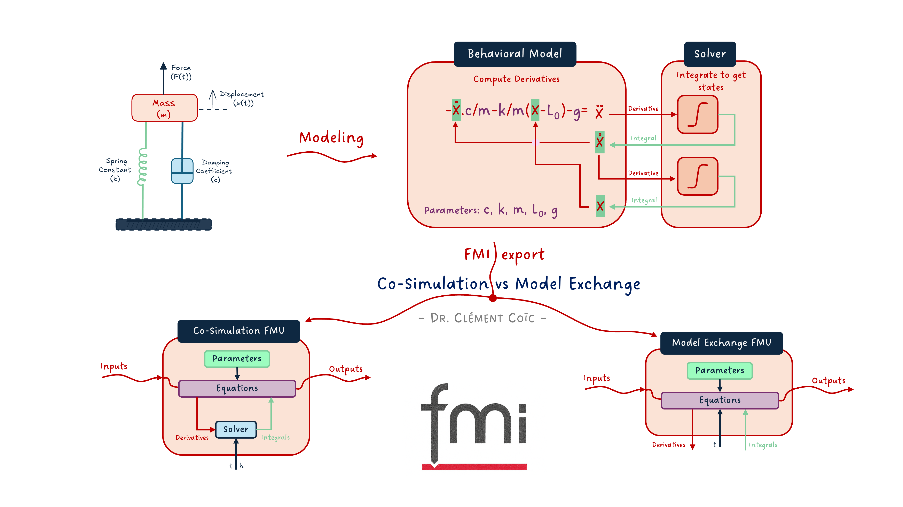
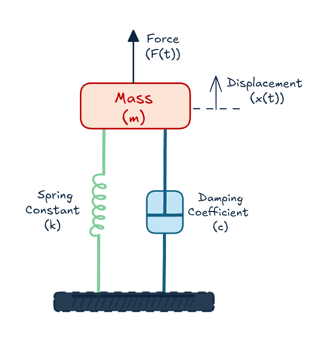
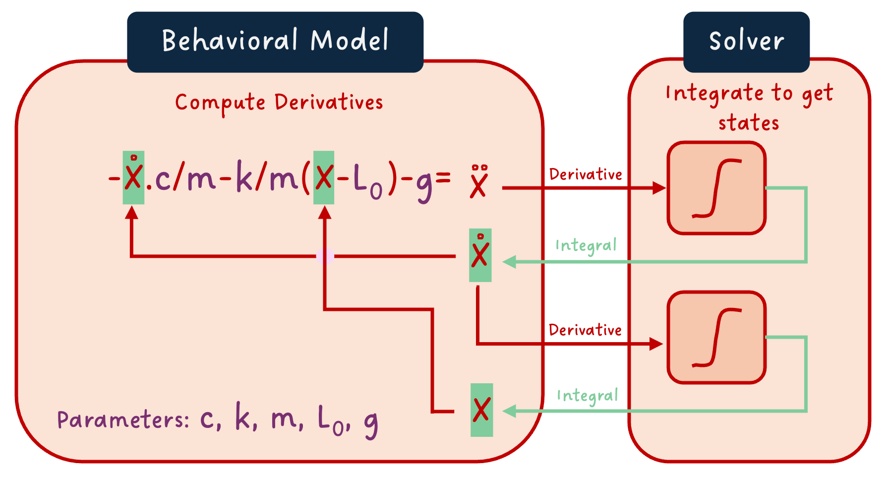
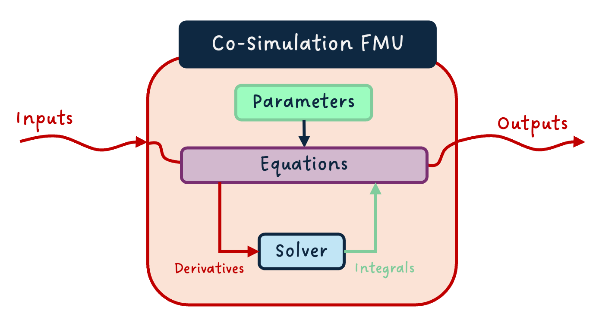
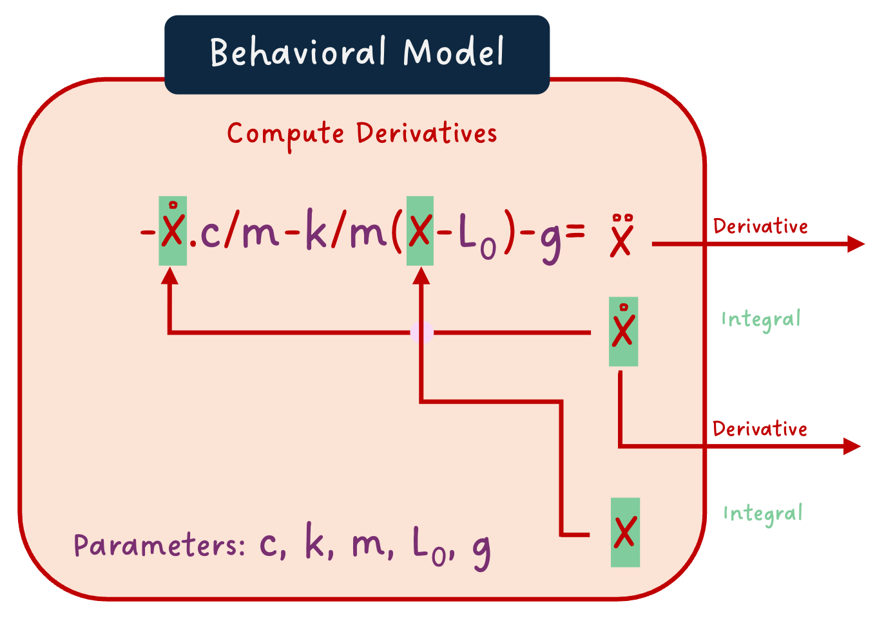
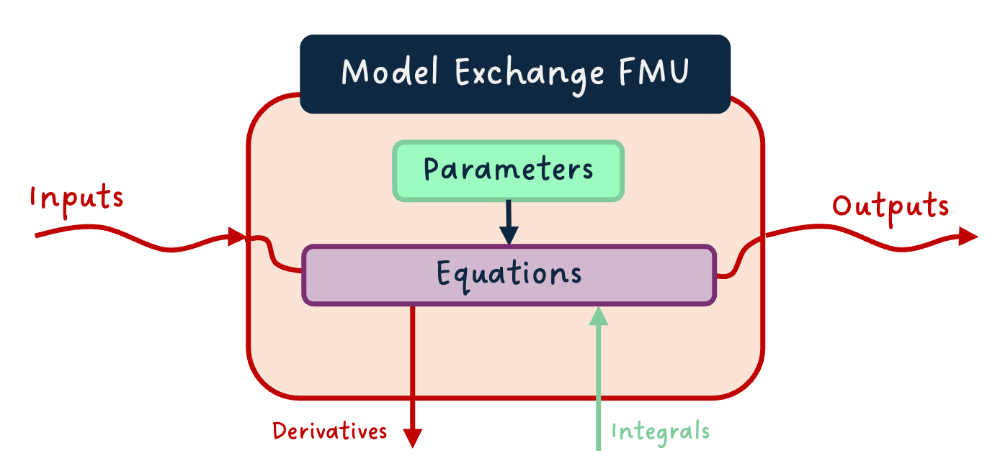
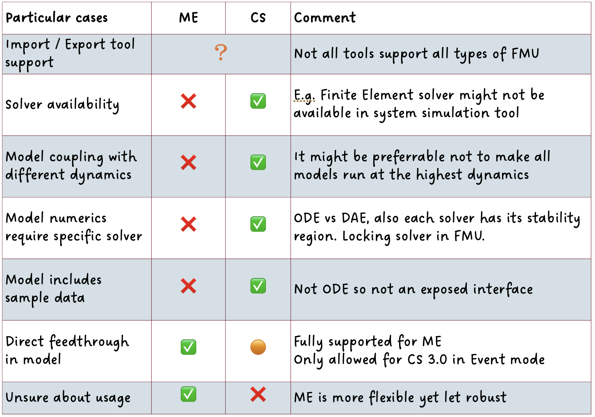

*I hope you've got your preferred drink in hand* ☕️🫖💧

📬 📰 **Saturday editions** - for having more time to read during the weekend! Let me know if this is not a convenient day (❓).

Before we start, let me just mention that I am starting a [YouTube channel: Clem's Playground](https://www.youtube.com/@ClemsPlayground), where I am uploading consistently videos about modeling, simulation, Modelica and FMI. For now, there is only a teaser: the presentation of Christian Bertsch - project leader of the FMI standard. The next video of his interview is already planned for next week. So 🔔 subscribe to the channel, not to miss any! 😉

As you know, this newsletter is about modeling and simulation. Many concepts are generic. It is however called "Learn Modelica & FMI", so there is some technological focus towards both the Modelica language and the FMI standard.

And we have not discussed that much FMI, so far. This was intended. We needed to cover the basics to be able to discuss FMI further. Now it is almost time to play with our first FMUs.

But which FMU? Model Exchange or Co-Simulation? ... what does that even mean? Well, that's today's topic!
And you'll see why I say we need the basics. There is a lot of concepts that we discussed already that are needed for this one.

Let's get started!

## FMI - what was that?
We talked about FMI already. I won't repeat too much here, that would be unfair for the good "students" that read the article already 😉.

### A short reminder
Go back and dig into the coffee cup series: in [this article](./006-SpreadingWithFMI.qmd), we used the Functional Mock-up Interface (FMI) standard to share part of the model.

Just keep in mind that FMI is a standard to wrap your model in a standardized way, so that it can be shared and re-used in a different tool. A model exported following the FMI standard is called an FMU (Functional Mock-up Unit).

And especially important for this article: there are three different types of FMUs - Model Exchange, Co-Simulation and Scheduled Execution. The first two are the most commonly used and therefore we will focus on these today.

### Is FMI about modeling or simulation?
This is not really a good question to ask. And yet, it came to my mind when writing this... so maybe it comes to yours too! And I don't want to leave this unanswered.

The good answer is "kind of neither". FMI defines how to export a model in a standard way. It does tell you how to package and interact with the model. It does not standardize the way to model, nor to simulate.

Now that said, the "kind of" in "kind of neither" is not there for nothing. When exporting a model (with FMI or not), you do have to carefully think about your modeling assumptions, your interfaces and so on - the architecting of the model. And you also have to understand your simulation needs to be able to make the right type of FMU selection and, in the end, simulate the model.
So there are some modeling and simulation flavors in FMI!

Another point about the "kind of": FMI is causal. (What is (a)causality? You should know from my past articles on the topic ([here](./007-AcausalityEquation.qmd) and [there](./008-AcausalityModels.qmd).) And this, independently of whether your modeling software is causal or acausal. This is to ensure compatibility as acausal software can deal with causal models, but not the other way around. So again, you might model in one tool, and the export as an FMU changes the model a tiny bit (there is a compilation step, unless you have a source code FMU - not discussed here). So see it as modeling or not, what matters is having well-defined model interfaces, architecture and so on. 😊

## Where does the solver live?
Who is solver? Where does they live? The answer is 42... ok, I am out...

Allow me to restart this section...

I like a lot the drawing of a suspended mass that Pratibha did. So let's use it again here.



It is also very convenient because writing the equations is quite easy. We end up with the following set of equations:

```
a = -c/m * v -k/m * (x-L0) - g
a = der(v)
v = der(x)
```

Where `a` is the acceleration, `v` the speed, `x` the position and `m` the mass of the mass. The parameters `c`, `k`, `L0` and `g` are respectively the viscous coefficient of the damper, the stiffness and initial elongation of the spring, and the acceleration of gravity. As expected :) 

### A dynamic model needs a solver
Do you remember [what dynamic simulation does](./010-WhatDynamicSimulationDoes.qmd)?

One part that we left over was the solver. We did not cover it in detail, and we won't do it today either. We'll do that soon.

> And if you are impatient, you can read [my note about Forward Euler](https://www.linkedin.com/posts/clementcoic_drccodesolverpart1-activity-7275053029580566528-Xhr8/) and watch [this animation](https://www.linkedin.com/posts/clementcoic_%F0%9D%97%A8%F0%9D%97%BB%F0%9D%97%B1%F0%9D%97%B2%F0%9D%97%BF%F0%9D%98%80%F0%9D%98%81%F0%9D%97%AE%F0%9D%97%BB%F0%9D%97%B1%F0%9D%97%B6%F0%9D%97%BB%F0%9D%97%B4-%F0%9D%97%A2%F0%9D%97%97%F0%9D%97%98-%F0%9D%98%80%F0%9D%97%BC%F0%9D%97%B9%F0%9D%98%83%F0%9D%97%B2%F0%9D%97%BF%F0%9D%98%80-activity-7317890082101780480-phce) I did to show how it works in practice. This is still the most basic solver. Yet, it is great to understand how one solver can work.

What we will remind here is that the job of the solver is to integrate the derivatives to compute the value of the state variables "a small amount of time later" (remember the [solving of the two tanks problem](https://www.linkedin.com/pulse/009-need-dynamic-simulation-dr-cl%C3%A9ment-co%C3%AFc-mzzmf/)?).

> Another note here: saying that the solver computes the states is a special case. The state selection is not unique (and I would even argue there is an infinite number of state candidates for each model). Nevertheless, in most cases, we need one (independent) state per integral in the model, and the output of the integral is a state candidate. As it is just not the point of this article to discuss state selection, I won't focus on that further.

So if you have: `der(x)=f(x)`    
Then the solver will be able to solve the value of `x`.

If we separate with our mind the behavioral model that we implement and the solver, then it would look like the image below:



We see the same equations as previously written, only the derivation relationships are in integral forms. We see that "x dot dot", which is the double time derivative of the position `x` - hence the acceleration -, is "sent" to the solver, and it returns "x dot" - the integral of the acceleration, i.e. the speed. Similarly, the speed is sent to the solver that computes the position from it.

To me, this image shows clearly that, to simulate the behavioral model, a solver is needed! Yet the question remains: where does the solver live?

### The Co-Simulation FMU
The solver is clearly needed to simulate the model, so let's just package it with the model!

From the last figure, we wrap it all in an FMU and we get a so-called "Co-Simulation" FMU. In a more generic case, we might have inputs, outputs and parameters so it overall looks like that:



This is great because the FMU is kind of "self-contained". Provided inputs and parameters, you can simulate it directly.

### The Model Exchange FMU
And the solver does not have to live together with the model! The image we defined in our mind showed it well. In fact, if we remove the solver from this image, we expose the additional needed interfaces to package the behavioral model as a "Model Exchange" FMU:



And naturally, as for the co-simulation case, we can have a generic view with the inputs, outputs and parameters, and added derivatives outputs and integral inputs (put on the bottom as it is usually represented):



That is very flexible, because we just export the model equations and we can couple any solver that makes sense to it in the future. Or better, share these equations with another part of a model and use a single solver for both!

### A tiny subtlety
For both types of FMUs, the current simulation time and, for co-simulation, the communication step size are also inputs to the FMUs. The simulation time might be needed by some equations (e.g. time events) and for synchronizing simulations. The communication step size is required when coupling co-simulation FMUs, and allows for complex scenarios like variable communication step size, when an FMU requires it.

For keeping the diagrams simple here and consistent with the "mind image" of the suspended mass model, we have not represented these in the last images. However, if you have noticed, the header image has them. 🙂 

## So when do we use what?
In a [previous post](https://www.linkedin.com/posts/clementcoic_drccfmioverviewandlessonslearnt-activity-7344259654308302849-IKXy), I shared my thoughts on the FMI standard, some lessons learned, and the below table:



This table summarized well - in my opinion... well, I wrote it, so I might be biased... - some cases when one should choose Model Exchange or Co-Simulation FMUs. These cases are straightforward for some and more involved for others. 

A typical example of obvious choice is if your [tool supports](https://fmi-standard.org/tools/) only one of the two... well, this is the one you need to use! 💡    
Sometimes, you actually want to ensure that the model is coupled with a given solver - because the numerics require it or because it is a very specific solver (e.g. a CFD solver) -, or with its own time step (because dynamics are different from the rest of the system), then you want to use Co-Simulation if possible.    
On the other side, if you want to use the same solver between different shared models, or if you have a direct feedthrough (an output that is algebraically linked with one or more inputs), or if you want flexibility in the future, then Model Exchange is the better choice.

## The END for today
Enough for today. 
I just want to conclude with a comment from Ben Landgrén, that I find particularly nice about FMI:

> "One of my favorite features of FMI is that a simulation engineer can make a complex model simple and safe to use for somebody who is not a simulation engineer." Ben Landgrén

I think this shows that the use of FMI is even broader than what it was initially made for.

*Break is over, go back to what you were doing.*

Clem


[Next](./about.qmd) ->