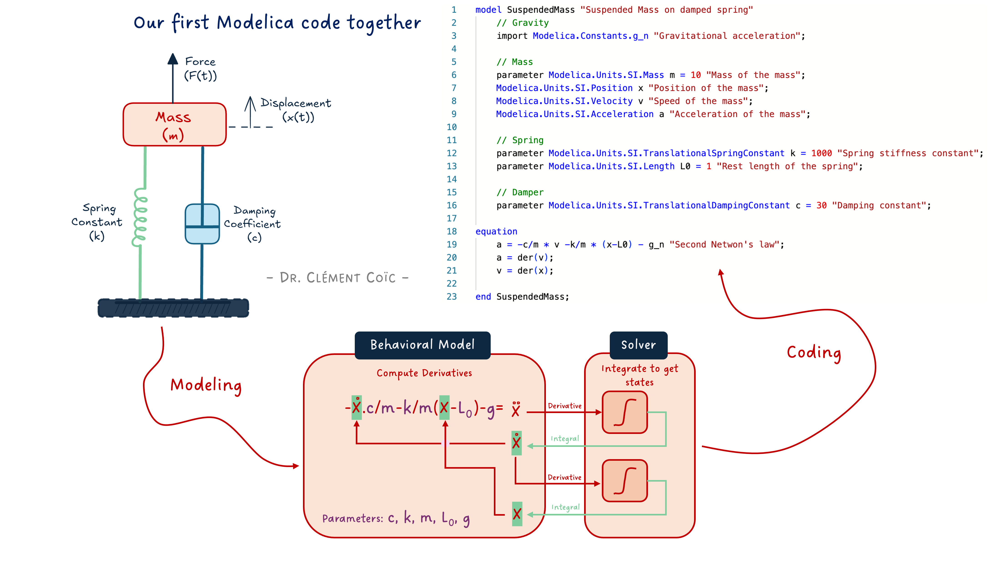
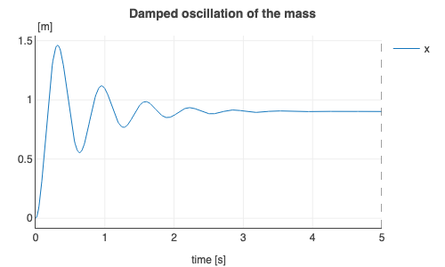
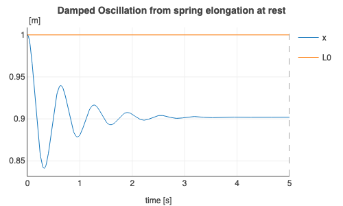
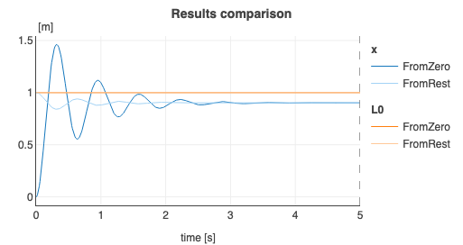

*I hope you've got your preferred drink in hand* ☕️🫖💧

📬 📰 **Saturday editions** - for having more time to read during the weekend! Let's experiment for a few weeks. Let me know if this is not a convenient day (❓).

Before we start, I will soon publish some Modelica videos on my [YouTube channel: Clem's Playground](https://www.youtube.com/@ClemsPlayground). So far, I am publishing weekly some parts of Christian Bertsch's interview - the FMI project leader -, giving unbiased insights about the FMI standard. And there is much more in the pipeline. So 🔔 subscribe to the channel, not to miss any! 😉

It's crazy. We are at the 17th article of this newsletter, and we discussed a lot of the main concepts of Modelica - and modeling and simulation in general. And we have seen almost no code.    
Of course, this was intended so. And it is part of the beauty of Modelica: the duality between the code and the diagram interface.

Today is the day we start writing some code!

## Why code?
That is a great question! Thanks for asking...

Well, there are plenty of reasons NOT to use code. In many cases, you can just [drag and drop and connect components](./003-FirstModel.qmd), [build submodels with interfaces](./005-ModelRefactoring.qmd), [use templates](./012-ReplaceableModels.qmd)... I would recommend that anytime it is possible! This is the way to build better models and avoid many typical errors (like sign convention). 

Yet, at some point, you might reach the limitation of this method:

- You might not have the models you need in the libraries that you have.
- You might prefer a different correlation than the one implemented.
- You might want to make a "back of the envelope" model - quick and dirty - to get some insights.
- You might need a different parametrization of some components.
- ...
- (or you might just want to have some fun, coding!)

The point is: having the choice between the graphical interface and coding is the key to flexibility.     
The point is NOT to code the graphical connections. You could. It would be impractical though... better letting the tool (or AI) do that!

So, let's have a look at the basic code structure and code our first model together! 

## The basic code structure
Today we will focus on building a `model`. We don't need to discuss in detail what it means now. Just keep in mind that it has an influence on what you can do inside. The basic structure of a `model` is roughly as follows:

```
model ModelName "Short description of the model"
    /*
    Multiple line description of the model if needed
    */

    // Imports, extends
    // Constant, parameters and variable declaration
    // Interfaces, submodel instances

initial equation
    // equations that are true only at initialization

equation
    // equations that are always true (also at initialization)
    // connect statements are equations!

    /*
    annotation(
        Icon(),
        Diagram(),
        Documentation(info="<html>Detailed documentation in html</html>"));
    */
end ModelName;
```

> I said this is "roughly" the structure. So if you feel you are missing something, feel free to mention it in comments 👇

Let's unwrap some key things in this pseudo-code structure:

- the model starts with `model`, then the name of the model - following the camelCase notation, but with an uppercase first letter. (The reason is that this is the object - remember we discussed it when talking about [replaceable models](./012-ReplaceableModels.qmd) - and the lowercase is used for the instance.)
- the model ends with `end`, followed by the model name and a semicolon.
- What matters a lot is to have all declarations and instances before the `equation` part. We see that in practice.
- there are many ways to add information in your model: with `//` for single line comments or `/**/` for multiple line comments, or with strings `""` in specific locations like just after the model name or before closing a variable declaration or an equation.
- the model "for free" comes with its code layer (what is actually saved), an icon view, a diagram view and a detailed html documentation. This is very convenient as you get all of these in one place - not separated.

> At the very beginning I got confused between the diagram and icon layer. So let me emphasize the difference: the diagram layer is where you assemble your components and the icon is its outer shell. 
> Remember [our first FMU of the hands](./006-SpreadingWithFMI.qmd)? The diagram layer included the interfaces, several components and connections. The icon was just the hands with the exposed interfaces.
> So when you drag and drop a model into another model, the icon is displayed. If you look inside, you are in the diagram layer.

Ok, this is getting boring. Even for me... let's get our hands dirty! With a simple example, things should make more sense.

## Let's get it coded
> Note: I am a big fan of doing something easy first. Doing something that you know, in a different way. The value is that you don't need to put effort into understanding several things at once. You know the topic, then you just have to focus on the implementation.
> So we'll code the famous suspended mass example, that was also discussed in [the last article about FMI](./016-MEvsCS.qmd) - get back to it quickly if needed. 
> I mean, this is typically a model that should be done by composition (drag&drop) - all component models are available in the MSL. It is really just for the purpose of explaining code that we will use it here.

### The mathematical model
We remind here the model we need to implement:

```
a = -c/m * v -k/m * (x-L0) - g
a = der(v)
v = der(x)
```

Where `a` is the acceleration, `v` the speed, `x` the position and `m` the mass of the mass. The parameters `c`, `k`, and `L0` are respectively the viscous coefficient of the damper, the stiffness and initial elongation of the spring. The constant `g` is the acceleration of gravity. As expected :) 

See I made the difference between variables, parameters and constants. This was discussed in [our first discussions about the Modelica code](./007-AcausalityEquation.qmd). We also mentioned that we can use SI units to refine the type of the variable or parameter or constant, instead of just using `Real` which would be for a floating point number.

### Our first version of the code
How does this look in Modelica? Like this:

```
model SuspendedMass "Suspended Mass on damped spring"
    // Gravity
    import Modelica.Constants.g_n "Gravitational acceleration";
    
    // Mass
    parameter Modelica.Units.SI.Mass m = 10 "Mass of the mass";
    Modelica.Units.SI.Position x "Position of the mass";
    Modelica.Units.SI.Velocity v "Speed of the mass";
    Modelica.Units.SI.Acceleration a "Acceleration of the mass";

    // Spring
    parameter Modelica.Units.SI.TranslationalSpringConstant k = 1000 "Spring stiffness constant";
    parameter Modelica.Units.SI.Length L0 = 1 "Rest length of the spring";

    // Damper
    parameter Modelica.Units.SI.TranslationalDampingConstant c = 30 "Damping constant";

equation
    a = -c/m * v -k/m * (x-L0) - g_n "Second Newton's law";
    a = der(v);
    v = der(x);

end SuspendedMass;
```

> If you have followed [last week article](./016-MEvsCS.qmd), one question could come to mind: where does the solver live? Here we specified the derivative/integral relationships with the `der()` operator. The Modelica compiler will be able to see these and couple them with the tool's solver. Pretty neat! No need to code the solver here. Back to our topic...

First draft of our model. What do we expect from it? We want to observe the mass position oscillating with less and less energy until it reaches equilibrium. OK? Let's see:



Is it what we expected? Somehow yes! Somehow not...

We never really specified from which position the mass should start. And by default, the position is initialized at zero. So it is expected if you know that. And as a first-time coder, you might be surprised.

### Adding initial conditions
How could we specify the mass position at the start of the simulation? There are several ways, let's just add an initial equation. And we'll look at the compression of the spring due to the weight of the mass, from its rest position.

```
model SuspendedMassInitialized "Suspended Mass on damped spring"
    
    // Mass
    parameter .Modelica.Units.SI.Mass m = 10 "Mass of the mass";
    .Modelica.Units.SI.Position x "Position of the mass";
    .Modelica.Units.SI.Velocity v "Speed of the mass";
    .Modelica.Units.SI.Acceleration a "Acceleration of the mass";

    // Spring
    parameter .Modelica.Units.SI.TranslationalSpringConstant k = 1000 "Spring stiffness constant";
    parameter .Modelica.Units.SI.Length L0 = 1 "Rest length of the spring";

    // Damper
    parameter .Modelica.Units.SI.TranslationalDampingConstant c = 30 "Damping constant";

initial equation
    x = L0 "The mass shall start at the position where the spring is at rest";

equation
    a = -c/m * v -k/m * (x-L0) - .Modelica.Constants.g_n "Second Newton's law";
    a = der(v);
    v = der(x);

end SuspendedMassInitialized;
```

The added `initial equation` enforces the initial position of the mass, and this is clearly seen on the results:



Nice!

### Quick results comparison
How does the result compare? We can overlay both plots to compare them:



Of course, the mass ends at the same steady position at the end of each simulation. This should be expected.

Is this position correct?

... That is what we will discuss in the next article!

## The END for today
Enough for today. Setting the ground for learning the code can be annoying with text. (I hope it wasn't...) Therefore, I am cutting the article here and keep some more for next time. While still basic, we will have some more fun and show some nice capabilities (and add documentation - which might not be fun 😅).

Let me know if it was a nice and useful read! I can steer more towards code or towards system-level models based on the needs.

*Break is over, go back to what you were doing.*

Clem


[Next](./about.qmd) ->