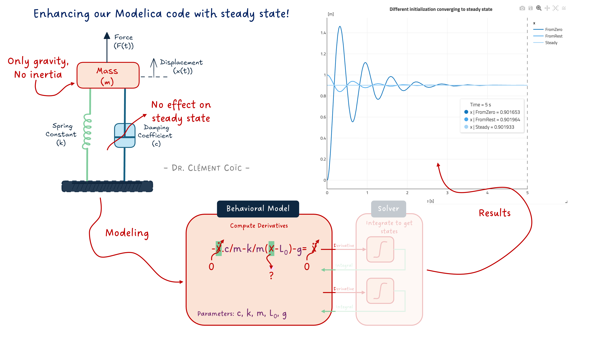
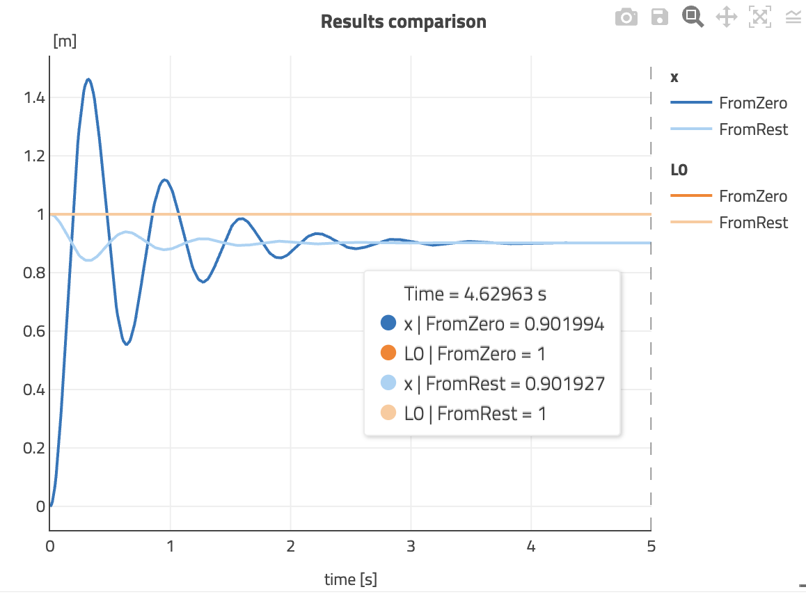
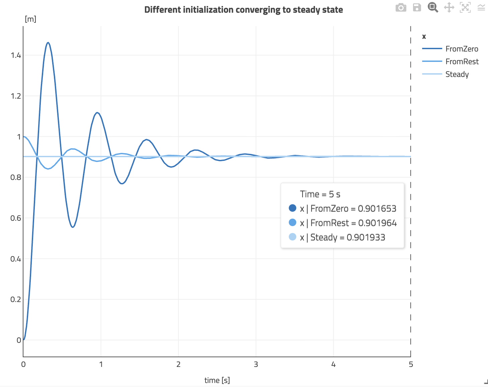
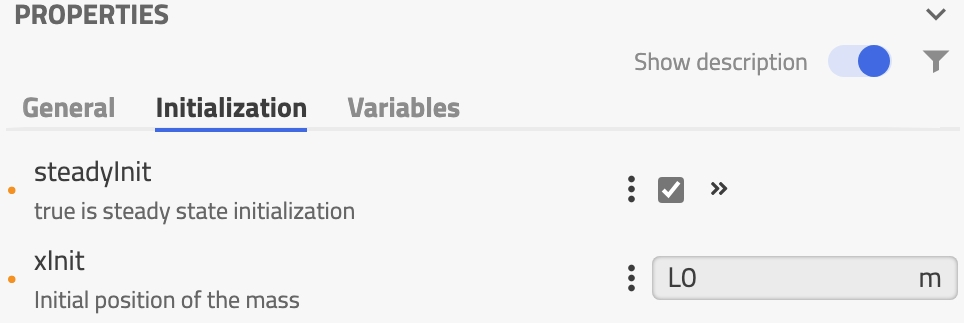
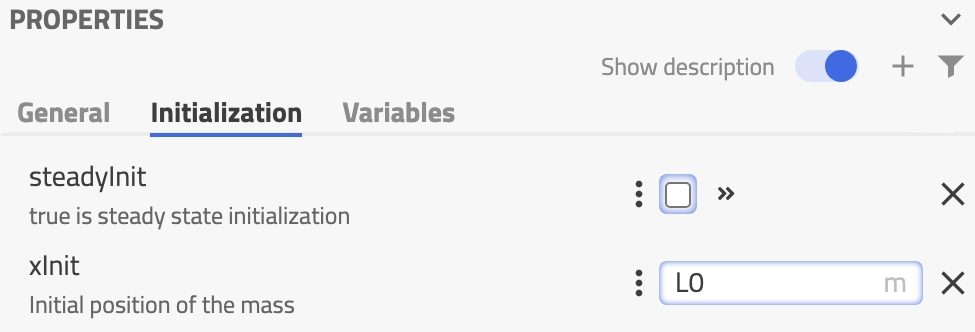

*I hope you've got your preferred drink in hand* ☕️🫖💧

📬 📰 **Saturday editions** - for having more time to read during the weekend! Let's experiment for a few weeks. Let me know if this is not a convenient day (❓).

🔔 *Subscribe to my [YouTube channel: Clem's Playground](https://www.youtube.com/@ClemsPlayground) to be notified when I start posting Modelica videos.* 🤓

We finished [last article](./017-BasicCode.qmd) in full suspense! Like a thriller, about to know who the killer is... and bim - advertisement break! Same happened with us. Almost...

We were having these two curves:


And everyone on earth was wondering: "Is the steady state position of the mass correct?"

*Ok... I might slightly exaggerate... just a tiny bit... but eh, weren't you just a little bit thinking about the answer? eh? Maybe not... Whatever.*

Well today we are going to answer this question and complete our code a bit more.

## THE answer
Yes!

Enough for today. In the next... 

What you want more detail? Ok. 😉

(And yes, if you wonder... I am in a good mood at the moment.)

OK - back to seriousness!

What should be the position of the mass at steady states? The answer is in the question. "Steady states" means that the states are steady (read "constant"). And if you remember your math courses, if a variable is constant, then its derivative is zero. So at steady states, the derivatives of the states are zero.

So in the case of our mass, the states are the speed `v` and position `x` - check [this article](./016-MEvsCS.qmd) again if you don't remember why. Then the state derivatives are the acceleration `a` and speed `v`. And we want to set them to zero. Let's show the equation:

`a = -c/m * v -k/m * (x-L0) - g  => steady => 0 = -c/m * 0 -k/m * (x_steady-L0) - g <=> x_steady = L0 - m*g/k`

In our case, the length at rest of the spring `L0` is 1m, the mass `m` is 10kg and the gravitational acceleration `g` is roughly 9.81.
So the mass gives us `x_steady = 1 - 9.81*10/1000 = 1 - g/100 = 0.9019`. And this is pretty much the value we get!



Why "pretty much"? Because after the 5 seconds of simulation, the steady state is not completely reached actually. I would have to let it run a bit longer.

But I don't want to do that! I want us to ask Modelica to solve it!

## Coding the steady state solving
Because [Modelica is acausal](./007-AcausalityEquation.qmd), it can manipulate the equations that you provide and do the solving for you. We can leverage that in our model.

And to make things even more interesting, we will:

1. keep the possibility to parametrize the initial position and toggle to steady state, and
2. show that we can play around with the way parameters are organized in the model.

Let's dive in!

### Conditions flow
In order to be able to toggle between setting the initial position of the mass and solving for steady state, we need to discuss how to define conditions in our code. Indeed, unless the initial condition specified is the steady state, then we cannot statisfy both at the same time. (And even if they were the same, writing twice the equation would over constrain our problem - [the system needs to be square](./008-AcausalityModels.qmd!).)

This condition flow is achieved with an "if-statement". We saw it briefly when discussing [conditional models](./013-ConditionalModels.qmd). Let's detail the syntax:

```
if condition1 then
    // equation(s)
elseif condition2 then
    // equation(s)
else
    // equation(s)
end if;
```

Two notes here:

1. There can be a different number of "equation(s)" for each condition. There can also be none in some cases.
2. You could have as many `else if` as meaningful. Ending with an `else` catches all other cases.

The conditions are `Boolean` expression, so they need to be either `true` or `false`.

### Making our initialization condition-based
Now we are geared to code the initialization as desired. We create a Boolean parameter `steadyInit` that will be used as a Boolean expression in our `if-statement` to activate either the derivatives to be zero, or the initial position of the mass to be specified:

```
model SuspendedMassSteady "Suspended Mass on damped spring"
    
    // Mass
    parameter .Modelica.Units.SI.Mass m = 10 "Mass of the mass";
    .Modelica.Units.SI.Position x "Position of the mass";
    .Modelica.Units.SI.Velocity v "Speed of the mass";
    .Modelica.Units.SI.Acceleration a "Acceleration of the mass";

    // Spring
    parameter .Modelica.Units.SI.TranslationalSpringConstant k = 1000 "Spring stiffness constant";
    parameter .Modelica.Units.SI.Length L0 = 1 "Rest length of the spring";

    // Damper
    parameter .Modelica.Units.SI.TranslationalDampingConstant c = 30 "Damping constant";

    // Initialization
    parameter Boolean steadyInit = true "true is steady state initialization" 
        annotation ( Dialog ( tab = "Initialization") );
    parameter .Modelica.Units.SI.Length xInit = L0 "Initial position of the mass" 
        annotation ( Dialog ( tab = "Initialization", enable = not steadyInit ) );

initial equation
    if steadyInit then
        a = 0;
        v = 0;
    else
        x = L0 "The mass shall start at the position where the spring is at rest";
    end if;
    
equation
    a = -c/m * v -k/m * (x-L0) - .Modelica.Constants.g_n "Second Newton's law";
    a = der(v);
    v = der(x);

    annotation(
        Documentation(info = "
        <html>
            <p>This model of a suspended mass allows us to toggle between two different initialization:</p>
            <ol>
                <li>a steady state initialization with steadyInit set to true.</li>
                <li>a specified initial position of the mass xInit, when steadyInit is set to false.</li>
            </ol>
        </html>"));
end SuspendedMassSteady;
```

As you can see, it is pretty much straightforward to code. But does it work?



The flat line is the steady state simulation! We could just simulate 0 second and already get our answer: what is the equilibrium position. And here, we see again that after 5 seconds, our dynamic responses converge towards the steady state response.

> Note that in steady state simulation, there is no time integration happening. The equations are solved as algebraic equations. This is why the simulation is instantaneous. And that also means that nothing is sent to the solver for time integration.

### But what are these "annotations"
You might have noticed these annotations when defining the initialization parameters?
There are many annotations actually in Modelica. They help specifying things that are typically not part of the physical modeling, like the user interface for example. And that is exactly what the `Dialog` annotations do.

- `annotation ( Dialog ( tab = "Name your tab"))` allows you to place the parameter in a separate tab on the Graphical User Interface of the tool (see image below). You could also define groups of parameters by the way ( `annotation ( Dialog ( tab = "tabName", group = "groupName"))` ).
- As the parameter `xInit` defining the initial position of the mass is only used when we are not simulating the `steadyInit` case, we can enable it only in this case. The `enable = not steadyInit` does exactly that. (When `steadyInit` is `false`, then `not steadyInit` is `true`.)

Here is how these menus render in Modelon Impact:





I really like being able to tweak the parameterization of my models! Organizing them as I want, in tabs and groups, making sure that the user cannot fill information that won't be used, etc. This is a really neat thing to have and you should use it. 😊

### Improve the doc, doc
Finally, I just wanted to show how the last model annotation can contain the model documentation in HTML. Here it is really basic - as I didn't want to have a huge textual model in this article - and many things we wrote in the article and [the previous one](./017-BasicCode.qmd), with results, could be part of the documentation.

Now you know it exists. In most tools, you don't need to write the HTML tags, there is a documentation editor that looks like any text editor and does the tagging for you.

## The END for today
Enough for today. I hope you had a bit of fun. We made sense of our results, let Modelica do the solving for us and tuned the code to look "sexier". I like to say it like that because a "nice looking" model is a model that you want to reuse. So don't think you are wasting time doing nice icons, writing good documentation or organizing your parameters / variables. This is important work, paving the road toward success!

Let me know if it was a nice and useful read! I can steer more towards code or towards system-level models based on the needs.

*Break is over, go back to what you were doing.*

Clem


[Next](./about.qmd) ->