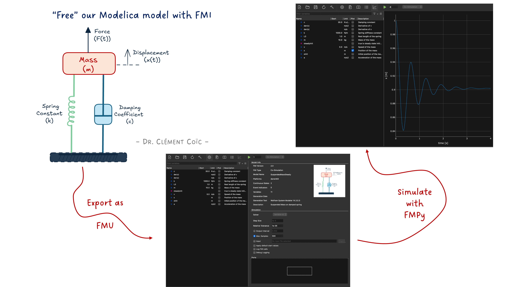
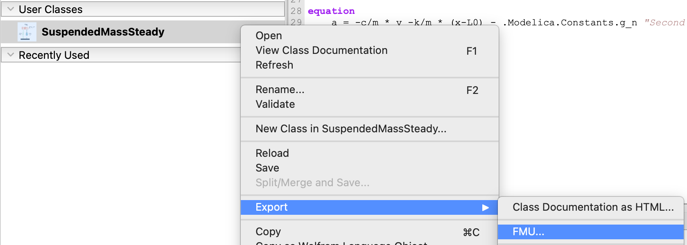
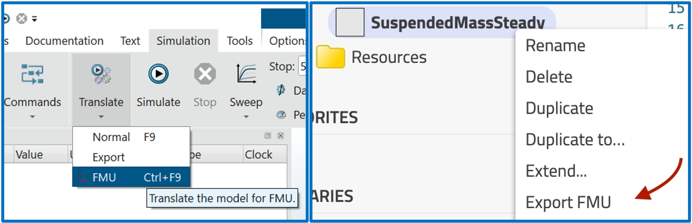
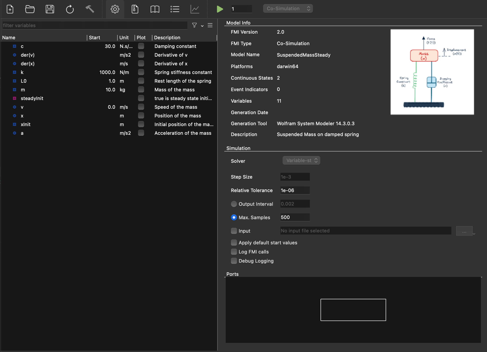
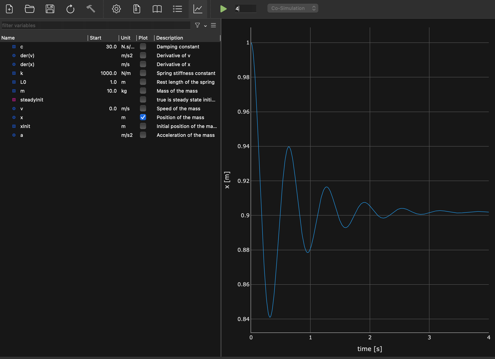
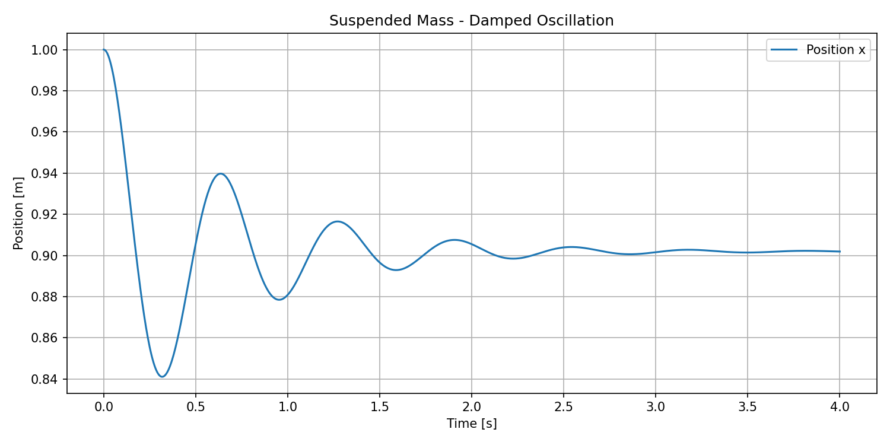
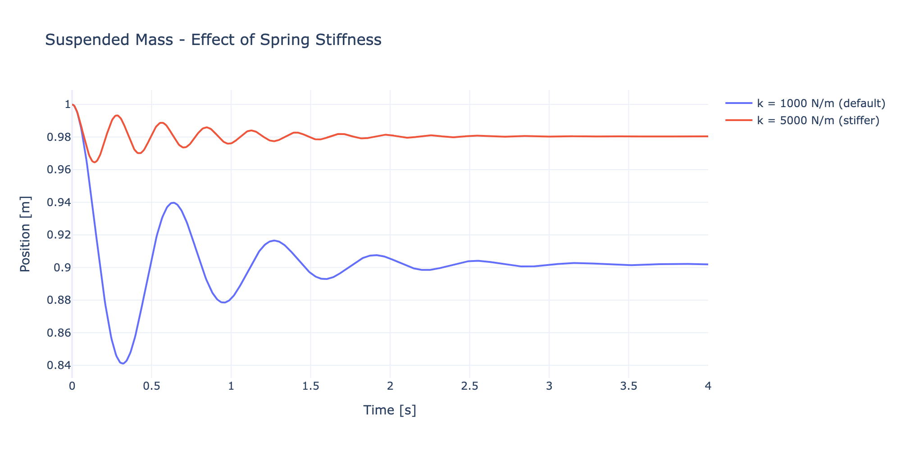

*I hope you've got your preferred drink in hand* ☕️🫖💧

📬 📰 **Saturday editions** - for having more time to read during the weekend!

🔔 *Subscribe to my [YouTube channel: Clem's Playground](https://www.youtube.com/@ClemsPlayground): there are a few videos of the interview of Christian Bertsch - FMI project leader -, and more to come.* 🤓

We finished [last article](./018-CodeEnhancement.qmd) with a quite nice model of the suspended mass system, with good initial condition parametrization and even the possibility to run it in steady state.

What I did not tell you is that I also exported it as an FMU (Functional Mock-up Unit)!
There are built-in FMU export capabilities in most Modelica tools. For example, in Wolfram System Modeler, you can just right-click on the model and select "Export FMU".



Similarly, in Dassault Systèmes Dymola you can press CTRL+F9 or in Modelon Impact, you can right-click on the model and select "Export > FMU...".



You have to choose the FMU type (Model Exchange or Co-Simulation) and the FMI version (2.0 or 3.0), and some additional settings. This is something you already know if you have read [my previous article about FMUs](./016-MEvsCS.qmd). 😉

Today, we don't focus on this part because... we will simulate the FMU we just exported! And we won't use a Modelica tool for that. We'll use Python. 🐍

Why? Because the whole point of [FMI](./006-SpreadingWithFMI.qmd) is to "free" your model from the tool that created it. Export, share, simulate anywhere. And today, "anywhere" is a Python script.

Don't worry, it's going to be simple. You don't have to understand every line of code to get the most out of it. The goal is to show you how easy it is to simulate an FMU with Python (not the initial tool), and how powerful that can be for exploring your models in new ways.

## What is FMPy?

FMPy is an open-source Python library that allows you to simulate Functional Mock-up Units (FMUs) for both Model Exchange and Co-Simulation. It provides a simple interface to load, configure, and run FMUs, making it a great tool for testing and validating models exported from various modeling environments.

It has a Graphical User Interface (GUI) - so "an app" -, a command-line interface (CLI) - we won't need it here -, and a Python API - so you can control it via defined Python commands. And it is available for free! It is developed at Dassault Systèmes and released under the BSD 2-clause license.

So that's perfect for us to simulate our FMU without needing a full Modelica environment.

You can find more information about FMPy on its [official website](https://fmpy.readthedocs.io/).


## Installing FMPy

This section can look scary, but it is short. And I promise you, it's not going to be a nightmare. If you have Python installed, it's just one command away. And if you don't, then most likely it is enough to read the article and not to use these commands. 😊

Installing FMPy is as simple as:

```bash
pip install fmpy
```

If you also want the GUI (and trust me, you do — we'll use it in a minute), you can install the optional dependencies:

```bash
pip install fmpy[gui]
```

That's it. You're ready to go. *(I told you it was going to be short.)* 😉

## The FMPy GUI

Before we write a single line of Python, let me show you something cool. FMPy comes with a built-in Graphical User Interface. You can launch it from the command line:

```bash
python -m fmpy.gui
```

This opens a window where you can drag and drop your FMU file — or open it via the menu. Let's open our `019_SuspendedMass.fmu`.



What do we see? The GUI shows us:

- **Model Info**: FMI version, FMU type (Model Exchange or Co-Simulation), model name, description...
- **Variables**: all the parameters and variables of our model — `m`, `k`, `c`, `L0`, `steadyInit`, `xInit`, `x`, `v`, `a`... Looks familiar? It should, [we wrote them](./018-CodeEnhancement.qmd)! 😊
- **Simulation Settings**: stop time, step size, and other options.

Look at that — we can inspect every single parameter and variable of our model without opening a Modelica tool. No code, no terminal. Just a GUI. Pretty handy for a quick check, right?

And we can even change parameter values directly in the GUI before running the simulation!

## Simulating with the GUI

Now the exciting part. Click "Simulate" (or hit the play button), and...



There it is! The same damped oscillation of our suspended mass that we saw in [article 18](./018-CodeEnhancement.qmd). Same model, same equations, same results — different tool. 🎉

This is exactly the promise of FMI in action: build your model in one place, simulate it somewhere else. And "somewhere else" can be as simple as a free Python tool with a GUI.

*(I sound like a salesperson for FMI right now, don't I? Well, I'm not paid for it, I'm just genuinely impressed by how smoothly this works.* 😅 *I should be transparent and say that it is not always the case though.)*

At this point, if all you need is a quick look at your FMU results, the GUI is perfect. Open, simulate, plot, done. Coffee-break-compatible. ☕️

But what if you want more control? What if you want to run 50 simulations with different parameters? What if you want to post-process the results in your own way? That's where scripting comes in.

## Now let's script it

Time to write some Python! Don't worry, it's going to be short or at least readable. FMPy's API is designed to be simple.

### The basics: simulate and get results

Here's the minimum code to simulate our FMU:

```python
from fmpy import simulate_fmu

# Simulate the FMU with default parameters for 4 seconds
result = simulate_fmu('019_SuspendedMass.fmu', stop_time=4)

# What did we get?
print(result.dtype.names)  # Column names
print(result.shape)         # Number of time steps
```

The `simulate_fmu` function returns a NumPy structured array. Each column corresponds to a variable (time, position, speed, etc.), and each row is a time step. That's it — two (meaningful) lines of code to run an FMU simulation. Not bad! 💡

### Plotting with matplotlib

Let's plot the position of the mass over time, the classic way:

```python
import matplotlib.pyplot as plt
from fmpy import simulate_fmu

result = simulate_fmu('019_SuspendedMass.fmu', stop_time=4)

plt.figure(figsize=(10, 5))
plt.plot(result['time'], result['x'], label='Position x')
plt.xlabel('Time [s]')
plt.ylabel('Position [m]')
plt.title('Suspended Mass - Damped Oscillation')
plt.legend()
plt.grid(True)
plt.tight_layout()
plt.show()
```



### Plotting with Plotly

If you prefer interactive plots (zoom, hover, pan...), Plotly is a great alternative:

```python
import plotly.graph_objects as go
from fmpy import simulate_fmu

# Default spring stiffness (k=1000)
result = simulate_fmu('019_SuspendedMass.fmu', stop_time=4)

# Stiffer spring (k=5000)
result_stiff = simulate_fmu(
    '019_SuspendedMass.fmu',
    stop_time=4,
    start_values={'k': 5000}
)

fig = go.Figure()
fig.add_trace(go.Scatter(
    x=result['time'],
    y=result['x'],
    mode='lines',
    name='k = 1000 N/m (default)'
))
fig.add_trace(go.Scatter(
    x=result_stiff['time'],
    y=result_stiff['x'],
    mode='lines',
    name='k = 5000 N/m (stiffer)'
))
fig.update_layout(
    title='Suspended Mass - Effect of Spring Stiffness',
    xaxis_title='Time [s]',
    yaxis_title='Position [m]',
    template='plotly_white'
)
fig.show()
```



Same model, two different spring stiffness values, one plot. The stiffer spring (k=5000) oscillates faster and settles closer to the rest length — exactly what you'd expect from the physics. And we didn't touch any Modelica code to get this comparison! 😊

### Getting a bit more out of it

Now, you might want to peek at the FMU content from Python too (no GUI needed). FMPy has a handy `dump` function for that:

```python
from fmpy import dump

dump('019_SuspendedMass.fmu')
```

This prints out all the model information: FMI version, type, parameters, variables, default experiment settings... Basically the same info the GUI shows, but in your terminal. Very useful for quick checks in an automated workflow.


## Why scripting beats clicking

At this point you might think: "OK, the GUI is simpler, why bother scripting?"

Fair question. It's actually the exact mirror of what we asked in [article 17](./017-BasicCode.qmd): *"Why code?"* — when the graphical interface works just fine.

And the answer is similar:

- **Reproducibility**: a script is a record. Run it again tomorrow, you get the same results. Try reproducing a sequence of 15 clicks in a GUI... 🙄
- **Automation**: want to run 100 simulations with different spring stiffness values? A `for` loop beats 100 click sessions.
- **Integration**: your FMU results can feed directly into your data pipeline, your report generation, your optimization routine... all in Python.
- **Sharing**: send a colleague a 10-line script, not a 15-step tutorial with screenshots of where to click.

The GUI is perfect for **exploring**. Scripting is perfect for **producing**. And having both at your disposal? That's the sweet spot.

*(Spoiler: in future articles, we might just leverage this scripting capability to do some really fun things with our models. Stay tuned... 😉)*

And a final point: what this also shows is that if we are able to run our FMU in a small Python script, then any tool vendor can implement an FMI import and run functionality. You don't need a full Modelica environment to simulate a Modelica model. Actually, the FMU might come from a totally different source (e.g. Simulink). That's the power of standards and open formats. It opens up a world of possibilities for how we can use and share our models.

## The END for today

Enough for today. We haven't used a single Modelica tool, and yet we just simulated a Modelica model. Think about that for a second. 🤯

Before next time, here's a mini-challenge: try changing the damping or the mass in the Python script and compare results. You don't need a Modelica tool for that anymore. 😉

*Break is over, go back to what you were doing.*

Clem


[Next](./020-WhatsInsideAConnector.qmd) ->