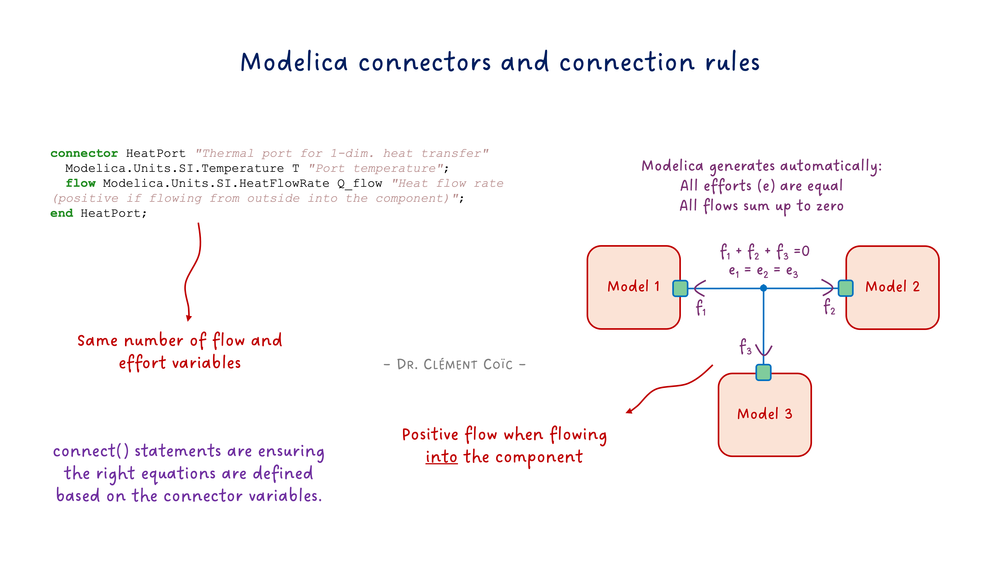
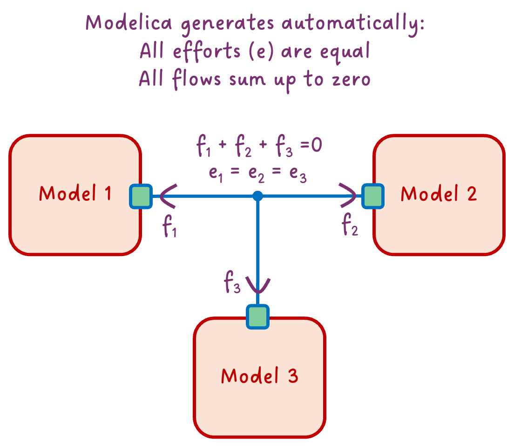

*I hope you've got your preferred drink in hand* ☕️🫖💧

Remember [our coffee cup model](./003-FirstModel.qmd)? We dragged components, connected them with lines, and boom—physics happened. But have you ever wondered: what's actually *inside* those little squares where the connection lines attach?

Those are **connectors**. And they're doing way more than you might think.

We've been using them since article 3. We wrote `connect()` statements. We saw ports on components. But we never actually looked inside. Today, we open the box. 📦

## The simplest connector

Let's start with something almost too simple. What if we wanted a connector that just carries a temperature value? Nothing fancy—just a way to share a temperature between components.

Here it is:

```modelica
connector TemperaturePort
  Modelica.Units.SI.Temperature T "Temperature in Kelvin";
end TemperaturePort;
```

That's it. Three lines. 

> Well... we'll see in a second why this connector isn't actually "Modelica compliant".

A connector is basically a handshake agreement 🤝 about what information gets shared. Our `TemperaturePort` says: "When we connect, we'll share our temperature." Simple as that.

When we connect two components that have this connector, they will share the same temperature. That's pretty useful... but also pretty limited.

Why? Because in the real world, temperature isn't the only thing that matters when two thermal systems are connected. Heat also *flows* between them!

## The magic ingredient: flow

Here's where connectors get interesting. In physics, when two systems connect, something is usually *conserved*. Energy can't just appear or disappear. Current flowing into a junction must flow out. Heat entering a component must be stored or go out somewhere.

Modelica handles this with a special keyword: `flow`.

Let's upgrade our connector:

```modelica
connector HeatPort
  Modelica.Units.SI.Temperature T "Temperature in Kelvin";
  flow Modelica.Units.SI.HeatFlowRate Q_flow "Heat flow rate in Watts";
end HeatPort;
```

See that `flow` in front of `Q_flow`? That's the magic word. 🪄

Here's what it means: when you connect multiple components at a single point, Modelica automatically generates an equation that says **all the flow variables must sum to zero**.

> Now here is a fun note. Notice that "all flow sum to zero" requires a sign convention. In our case, we defined `Q_flow` as positive when flowing *into* the component. So if we have two components connected together, the equation would be: `Q_flow_a + Q_flow_b = 0`, which means that if `Q_flow_a` is positive (flowing into A), then `Q_flow_b` must be negative (flowing out of B). This sign convention is crucial for the math to work out correctly.
> Should you define the opposite sign convention (positive when flowing out of the component), the equation would be `-Q_flow_a - Q_flow_b = 0`, which is mathematically equivalent but less intuitive. The key is to be consistent with your sign convention across all components and connectors.
> Modelica convention is to define flow variables as positive when flowing into the component, which is why we follow that convention in our examples.

It's like Kirchhoff's current law for electrical circuits—what goes in must come out. Except it works for *any* physical domain: heat, fluid mass flow, mechanical force, you name it.



So in our thermal example:
- `T` is the **effort** variable (also called "potential")—it's the same for all connected components
- `Q_flow` is the **flow** variable—these must sum to zero

This effort/flow pair is the secret sauce of physical connectors. And it's why our models automatically respect conservation laws without us writing a single equation for it!

## Effort + Flow = Physical Connector

Now we can appreciate what a *real* physical connector looks like. Let's peek inside the actual MSL thermal connector—the one we've been using since [article 3](./003-FirstModel.qmd):

```modelica
connector HeatPort_a "Thermal port (filled icon)"
  Modelica.Units.SI.Temperature T "Port temperature";
  flow Modelica.Units.SI.HeatFlowRate Q_flow "Heat flow rate (positive if flowing into component)";
end HeatPort_a;
```

Look familiar? It's almost identical to our `HeatPort` from the previous section! The MSL just adds a documentation string and specifies the sign convention.

> If you are following along with the MSL, you might have noticed that there are actually *two* thermal connectors: `HeatPort_a` and `HeatPort_b`. They are identical except for the icon (filled vs empty). This is a convention to help users visually identify the direction of flow. But they are functionally equivalent.
> And you might also have noticed that they extends a common base connector `HeatPort`. And I substituted the base connector with our custom `HeatPort` in the example above to keep it simple. You should know by now that this is equivalent :)

This **effort + flow** pattern is everywhere in Modelica:

| Domain | Effort (potential) | Flow (conserved) |
|--------|-------------------|------------------|
| Thermal | Temperature `T` | Heat flow `Q_flow` |
| Electrical | Voltage `v` | Current `i` |
| Mechanical (translational) | Position `s` | Force `f` |
| Mechanical (rotational) | Angle `phi` | Torque `tau` |
| Fluid | Pressure `p` | Mass flow `m_flow` |

The beauty? **The same rules apply to all of them.** When you connect components:
- Effort variables become equal (same temperature, same voltage, same pressure...)
- Flow variables sum to zero (conservation!)

That's why you can drag-and-drop electrical components, connect them, and Kirchhoff's laws just *happen*. Same for thermal, mechanical, fluid... Modelica does the bookkeeping for you.

Pretty powerful for a few lines of code, right? 😉

## The balance rule

There's one more thing to know about physical connectors. You might have noticed that in our `HeatPort`, we have:
- 1 effort variable (`T`)
- 1 flow variable (`Q_flow`)

That's not a coincidence. **A well-formed physical connector has the same number of effort and flow variables.**

Why? Think about what happens when we connect two components:
- Each effort variable generates an equality equation (`T_a = T_b`)
- Each flow variable contributes to a sum-to-zero equation (`Q_flow_a + Q_flow_b = 0`)

If you have one effort and one flow, you get two equations for two unknowns per connection. The math works out. ✅

For electrical connectors, it's the same: one voltage (effort), one current (flow). For mechanical: one velocity, one force. The pattern holds.

What if you break this rule? You'll likely end up with an **unbalanced system**—either too many equations (overconstrained) or too few (underconstrained). Your model won't compile, or worse, it will give nonsense results - decoupled from the physics.

So when designing connectors: **keep them balanced!** ⚖️

## What connect() actually does

Alright, time to demystify the `connect()` statement. When you write:

```modelica
connect(componentA.heatPort, componentB.heatPort);
```

...Modelica doesn't just "draw a line." It generates actual equations. Two of them, to be precise:

**1. Effort equality:**
```modelica
componentA.heatPort.T = componentB.heatPort.T;
```

**2. Flow conservation:**
```modelica
componentA.heatPort.Q_flow + componentB.heatPort.Q_flow = 0;
```

That's it! That's the magic behind the connection line. 🪄

The first equation says: *"Both sides of the connection have the same temperature."* Makes sense—if two things are thermally connected, they share a temperature at the contact point.

The second equation says: *"Heat flowing out of A flows into B."* Conservation of energy. What leaves one component enters the other.

And when you connect *three* components at a single point (like in our diagram above), Modelica extends this:

```modelica
// All temperatures equal
componentA.heatPort.T = componentB.heatPort.T;
componentB.heatPort.T = componentC.heatPort.T;

// Flows sum to zero
componentA.heatPort.Q_flow + componentB.heatPort.Q_flow + componentC.heatPort.Q_flow = 0;
```

You never write these equations yourself. Modelica generates them from your connection lines. And that's why your models automatically respect physics! 🎉

*Side note: This is also why connecting incompatible connectors fails—if the variables don't match, Modelica can't generate these equations.*

## What about signal connectors?

You might be wondering: what about those connectors we use for control signals? They don't seem to follow the effort/flow pattern. Are they not "real" connectors? Like our first `TemperaturePort` example above?
It would then not be balanced, right? One effort variable, zero flow variables?

Signal connectors are a bit of a special case. They don't represent physical connections, but rather information flow. They typically have only effort variables (like `Real u` for an input signal) and no flow variables.

Because signal usually is associated with a given direction (inputs and outputs), they are tagged accordingly with `input` and `output` keywords. This is a convention that helps tools understand the intended use of the connector, and highlights which variable is outputting the signal value to the other connected ports. A tool would prevent you from connecting two inputs together or two outputs together. However, it doesn't define a clear [computational causality](./007-AcausalityEquation.qmd): you could still specify the output variable and the tool would figure out the input value (and maybe raise a warning about it).

In practice, we would have two connectors: one for the input signal (with an `input` variable) and one for the output signal (with an `output` variable).

```modelica
connector TemperatureInput
  input Modelica.Units.SI.Temperature T "Temperature in Kelvin";
end TemperatureInput;
```
And:

```modelica
connector TemperatureOutput
  output Modelica.Units.SI.Temperature T "Temperature in Kelvin";
end TemperatureOutput;
```

As signal connectors don't represent a physical port, the `connect()` statement for signal connectors doesn't generate flow conservation equations. Instead, it just generates equality equations for the effort variables.

So signal connectors are more like "data connectors" rather than "physical connectors." But they still play a crucial role in our models, especially for control and logic. 

## The END for today

Enough for today. You now know what's inside a connector:
- Effort variables (temperature, voltage, pressure...) that become equal
- Flow variables (heat, current, mass flow...) that sum to zero
- Two simple rules that make physics work automatically

Not bad for something we've been using since article 3 without ever looking inside! 😉

Oh, and if you've peeked into `Modelica.Fluid`, you might have noticed a `stream` keyword and *three* variables in those connectors. What's that about? That's a story for another day! But if you're curious, you can read [my post about stream connectors](https://www.linkedin.com/posts/clementcoic_%F0%9D%99%88%F0%9D%99%A4%F0%9D%99%99%F0%9D%99%9A%F0%9D%99%A1%F0%9D%99%9E%F0%9D%99%98%F0%9D%99%96-%F0%9D%99%8E%F0%9D%99%A9%F0%9D%99%A7%F0%9D%99%AA%F0%9D%99%9C%F0%9D%99%9C%F0%9D%99%A1%F0%9D%99%9E%F0%9D%99%A3%F0%9D%99%9C-%F0%9D%99%AC%F0%9D%99%9E%F0%9D%99%A9%F0%9D%99%9D-activity-7300148147534589952-m7FH) and play around with the dedicated lesson I wrote.

*Break is over, go back to what you were doing.*

Clem

[Next](./021-StreamConnectors.qmd) ->
