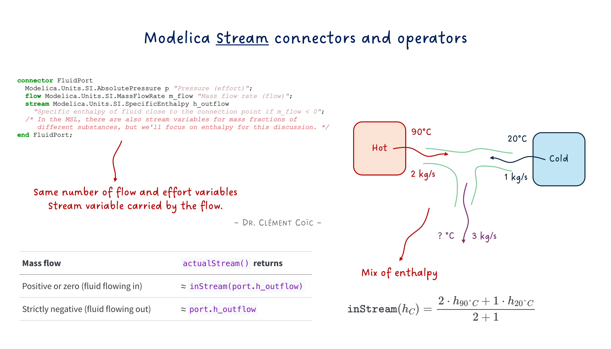
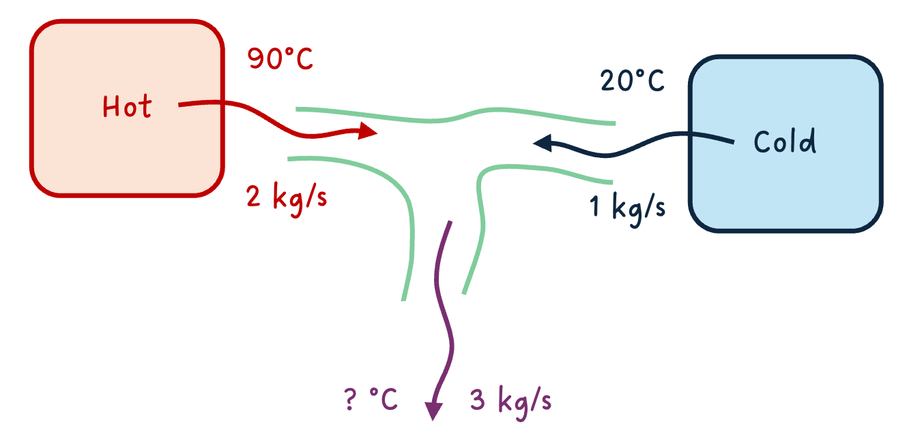
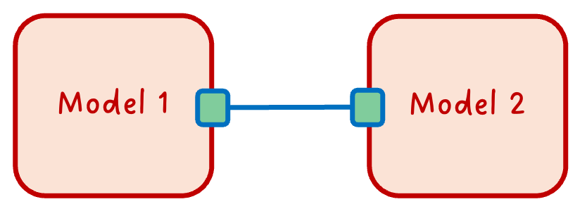
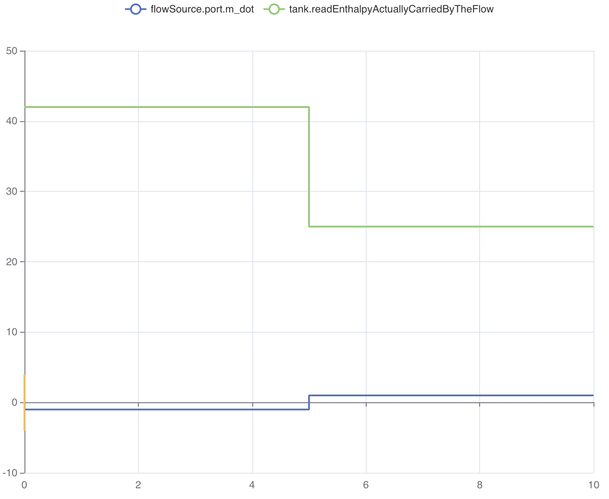

*I hope you've got your preferred drink in hand* ☕️🫖💧

Remember [the teaser from last time](./020-WhatsInsideAConnector.qmd)? We peeked inside connectors, found effort and flow variables, and I casually mentioned a `stream` keyword lurking in `Modelica.Fluid`. Time to deliver on that promise.

Here's a thought experiment: imagine hot water at 90°C flowing into a T-junction from the left, and cold water at 20°C flowing in from the right. They mix and flow out the bottom. Simple enough, right?

Now here's the problem: which temperature does the downstream pipe "see"? It depends on which way the fluid is flowing. And *that* can change during the simulation. 😅

Effort + flow got us far. But for thermo-fluids, we need one more trick. Let's dig into it!

## The problem with regular connectors

Let's go back to what we learned [last time](./020-WhatsInsideAConnector.qmd). A well-formed physical connector has effort and flow variables. For fluids, that would be:

```modelica
connector FluidPort_simple
  Modelica.Units.SI.AbsolutePressure p "Pressure (effort)";
  flow Modelica.Units.SI.MassFlowRate m_flow "Mass flow rate (flow)";
end FluidPort_simple;
```

Pressure equalizes at the connection point. Mass flow sums to zero. Conservation of mass: ✅. This is exactly the fluid row from our [effort/flow table in article 20](./020-WhatsInsideAConnector.qmd).

Now let's try to model our T-junction with this connector. Hot water comes in from the left (90°C), cold water comes in from the right (20°C), and mixed water flows out the bottom.



Here's the question: what is the temperature of the mixed water? Intuitively, it depends on *how much* hot vs. cold water is flowing in. If the hot side has a mass flow of 2 kg/s and the cold side has 1 kg/s, the mix will be closer to 90°C than to 20°C.

But our connector only carries pressure and mass flow. There's *no temperature information* in the connection. We literally have no way to compute the output temperature. 😮

"But wait," you might say, "can't we just add temperature to the connector? Like our thermal `HeatPort`?"

We could try:

```modelica
connector FluidPort_attempt
  Modelica.Units.SI.AbsolutePressure p "Pressure";
  flow Modelica.Units.SI.MassFlowRate m_flow "Mass flow rate";
  Modelica.Units.SI.Temperature T "Temperature... but whose?";
end FluidPort_attempt;
```

But think about what `connect()` would do with `T`: it would generate `T_a = T_b = T_c`, making all temperatures equal. That's the effort variable rule! The hot water, the cold water, and the mix would all be forced to the same temperature at the junction point. That's obviously wrong — 90°C ≠ 20°C. 🤦

And if we tried making `T` a `flow` variable? Then temperatures would *sum to zero*. That's even more nonsensical. Temperature is not a conserved quantity.

> Note that both of these attempts make the connector unbalanced - as we discussed last time, a connector must have an equal number of effort and flow variables. Adding a third variable without the right keyword breaks that balance and leads to incorrect equations.

The truth is, `T` is neither an effort nor a flow. It's something else entirely: an *intensive property* that travels *with* the fluid. Its value at the junction depends on *which direction* the mass is flowing. And that direction can change during the simulation.

This is the fundamental problem that the `stream` keyword solves.

## Enter `stream`

Modelica's answer to this problem is elegant: a third type of variable, declared with the `stream` keyword. It's specifically designed for intensive properties that are transported by fluid flow.

Let's have a quick view at what the `Modelica.Fluid` connector looks like:

```modelica
connector FluidPort
  Modelica.Units.SI.AbsolutePressure p "Pressure (effort)";
  flow Modelica.Units.SI.MassFlowRate m_flow "Mass flow rate (flow)";
  stream Modelica.Units.SI.SpecificEnthalpy h_outflow 
    "Specific enthalpy of fluid close to the connection point if m_flow < 0";
  /* In the MSL, there are also stream variables for mass fractions of different substances, but we'll focus on enthalpy for this discussion. */
end FluidPort;
```

See that `stream` keyword in front of `h_outflow`? That's the magic ingredient we were missing. 🪄

Let's unpack what's going on:

- **`p`** is the effort variable → equalizes at the connection point (same pressure)
- **`m_flow`** is the flow variable → sums to zero at the connection point (conservation of mass)
- **`h_outflow`** is the stream variable → carries the specific enthalpy *of the fluid leaving this component*

> Remember the sign convention discussed in [our previous article about connectors](./020-WhatsInsideAConnector.qmd)? Positive when entering the component.

That last point is crucial. Read the documentation string again: *"if m_flow < 0"*. This means that each component says: "If fluid flows *out of me* through this port, here's the enthalpy of that fluid." It's a conditional declaration — the value is only meaningful when the fluid actually flows outward. Else it doesn't play a role.

> Why `h_outflow` and not just `h`? Because the name reminds you of the convention: this is the enthalpy of the *outflowing* fluid from this component's perspective. Each side of a connection declares what it *would send out*. The system then figures out which side is actually sending and which is receiving.

Think of it like a restaurant kitchen with two doors. 🚪🚪 Each door has a sign that says "If I'm the exit, the food coming through me is a dessert, else a main course." The system then looks at which way people are actually walking to determine what food gets delivered where.

Back to our T-junction. With `stream` connectors, each of the three pipes declares its outflow enthalpy:

- Left pipe: "If fluid flows out of me, it has enthalpy corresponding to 90°C"
- Right pipe: "If fluid flows out of me, it has enthalpy corresponding to 20°C"
- Bottom pipe: "If fluid flows out of me, it has the mixed enthalpy"

Now the system has all the information it needs! But how does a component *on the receiving end* figure out what enthalpy is actually coming in? That's where `inStream()` comes in.

## `inStream()` — Asking the upstream question

So each component declares the enthalpy of its *outflowing* fluid via `h_outflow`. Great. But inside a component, what you usually need to know is: *"What enthalpy is coming IN to me?"*

That's exactly what `inStream()` does. It's a built-in operator that answers the question: "If fluid is flowing *into* my port right now, what is the value of the stream variable that's being carried in?"

Here's how you use it inside a component:

```modelica
model SimplePipe
  FluidPort port_a;
  FluidPort port_b;
equation
  // Mass balance
  port_a.m_flow + port_b.m_flow = 0;
  // Pressure drop (simplified)
  port_a.p - port_b.p = some_loss;
  // Enthalpy: what I send out is what came in from the other side
  port_a.h_outflow = inStream(port_b.h_outflow);
  port_b.h_outflow = inStream(port_a.h_outflow);
end SimplePipe;
```

Look at those last two lines. They say:

- "The enthalpy I would send out of `port_a` is whatever is streaming in through `port_b`"
- "The enthalpy I would send out of `port_b` is whatever is streaming in through `port_a`"

In other words: a simple pipe just passes the enthalpy through. No mixing, no transformation. Whatever comes in one end goes out the other. Makes sense! 🙂

### The two-component case

We have just seen what happens inside a component. But what about the connection itself? What equations does `connect()` generate for stream variables?
Let's start simple. Two components connected:



When Modelica sees `connect(A.port, B.port)`, it generates:

```modelica
// Effort equality (as always)
A.port.p = B.port.p;
// Flow conservation (as always)
A.port.m_flow + B.port.m_flow = 0;
// Stream variable magic ✨
// inStream(A.port.h_outflow) = B.port.h_outflow
// inStream(B.port.h_outflow) = A.port.h_outflow
```

For two components, `inStream()` is straightforward: the incoming stream value is simply the outflow value from the *other side* of the connection. If A sends out 90°C-equivalent enthalpy, then B receives 90°C-equivalent enthalpy. No surprises.

### The three-component case (our T-junction!)

Now it gets interesting. Three components connected at a single point. That's our T-junction!


What does `inStream(C.port.h_outflow)` return? C wants to know: "What enthalpy is flowing *into* me?"

The answer: a **mass-flow-weighted average** of the outflow enthalpies from all *other* connected ports that are actually sending fluid toward C.

Mathematically, for a connection set with $n$ connectors, `inStream()` for connector $i$ is defined as:

$$\texttt{inStream}(h_i) = \frac{\sum_{j \neq i} \max(-\dot{m}_j, 0) \cdot h_j}{\sum_{j \neq i} \max(-\dot{m}_j, 0)}$$

Where $\dot{m}_j$ is the mass flow rate and $h_j$ is `h_outflow` of connector $j$. The $\max(-\dot{m}_j, 0)$ picks out only the connectors that have fluid flowing *out* (into the connection point), and weights their enthalpy by how much mass they contribute.

> Again, the minus sign is because of the convention: positive mass flow means fluid is entering the component, so the flow leaving the component has a negative sign - we need to take its negative to get the correct contribution.

In our T-junction, if A sends 2 kg/s of 90°C fluid and B sends 1 kg/s of 20°C fluid (both flowing into the junction), then what C sees is:

$$\texttt{inStream}(h_C) = \frac{2 \cdot h_{90°C} + 1 \cdot h_{20°C}}{2 + 1}$$

A mass-flow-weighted mix. Exactly what physics tells us should happen! 🎉

> ⚠️ **Important**: `inStream()` is not a function you implement — it's a built-in language operator. The Modelica compiler generates the appropriate equations based on the connection topology. You just call it and trust the compiler to do the right thing. That's the [acausal magic](./007-AcausalityEquation.qmd) at work.

But there are cases where you actually need to know the *actual* enthalpy at a port, regardless of flow direction. For that, there's another operator: `actualStream()`.

## `actualStream()` — What you write in your models

So `inStream()` gives you the enthalpy of fluid coming *into* your port. But here's the thing: inside a component, you often need to compute energy balances. And for that, you need to know: "What is the *actual* enthalpy of the fluid passing through this port, regardless of flow direction?"

If fluid flows *in*, you want `inStream(port.h_outflow)` — the enthalpy carried by the incoming fluid.
If fluid flows *out*, you want `port.h_outflow` — the enthalpy your component is sending out.

You could write this yourself with an `if`:

```modelica
h_actual = if port.m_flow >= 0 then inStream(port.h_outflow) else port.h_outflow;
```

That's exactly what `actualStream()` does for you. It handles the logic of checking the flow direction and returning the correct value. So you can simply write:

```modelica
h_actual = actualStream(port.h_outflow);
```

| Mass flow | `actualStream()` returns |
|-----------|--------------------------|
| Positive or zero (fluid flowing in) | ≈ `inStream(port.h_outflow)` |
| Strictly negative (fluid flowing out) | ≈ `port.h_outflow` |

Conceptually, `actualStream()` behaves like this:



> This image is a screenshot from [my lesson](https://playground.modelica.university/id/kl7ztjGzuANuR1DED1S72) on Michael Tiller's Modelica playground app. Play with it yourself: [here](https://playground.modelica.university/?lesson=2&toc=https%3A%2F%2Fraw.githubusercontent.com%2FDr-ClementCoic%2FLinkedIn%2Frefs%2Fheads%2Fmain%2F05_Modelica%2Fstream.json)

But there's a nasty problem lurking here. What happens at *exactly* `m_flow = 0`? The `if` creates a sharp discontinuity — a sudden jump between two values. Numerical solvers *hate* this. 😤 It can create chattering, convergence issues, and sometimes outright simulation failures.

So most of the time, `actualStream()` isn't used alone. It's used in energy balance equations - `port.m_dot * actualStream(port.h_outflow)` - where the product of the mass flow and enthalpy mix naturally goes to zero as flow goes to zero, smoothing out the transition. So the product is smooth and continuous! (This is explained [here in the Modelica specification](https://specification.modelica.org/maint/3.6/stream-connectors.html#actualstream).)

This is really clever: near zero flow, this product **smoothly blends** between the inflow and outflow values using a regularization. No sharp jumps. No solver tantrums.

### When to use which?

Here's a simple rule of thumb:

- **`inStream()`**: Use when you're defining `h_outflow` equations. "What's coming in from the other side?" → used to compute what you send out. That's what we did in the `SimplePipe` example.
- **`actualStream()`**: Use when you need the *actual* enthalpy at a port for energy balance calculations. "What's the enthalpy of the fluid *actually* passing through here?"

And the good thing is that you might not need to think about this too much. If you're using `Modelica.Fluid` components, they already use these operators correctly under the hood. You just connect them and let the magic happen. But if you're building your own custom fluid models, now you know how to handle the enthalpy transport properly.

## The END for today

Enough for today. `stream`, `inStream()`, `actualStream()` — you now speak fluid connector. 🌊
I wanted to do more on this topic, like showing how to implement a T-junction component yourself using these concepts, but I think this is already a lot to digest. We can always come back to it in a future article if there's interest.

Next time: **initialization**. Or as I like to call it, "why does my model fail at t=0?" Stay tuned.

*Break is over, go back to what you were doing.*

Clem


<!-- [Next](./022-Initialization.qmd) -> -->
