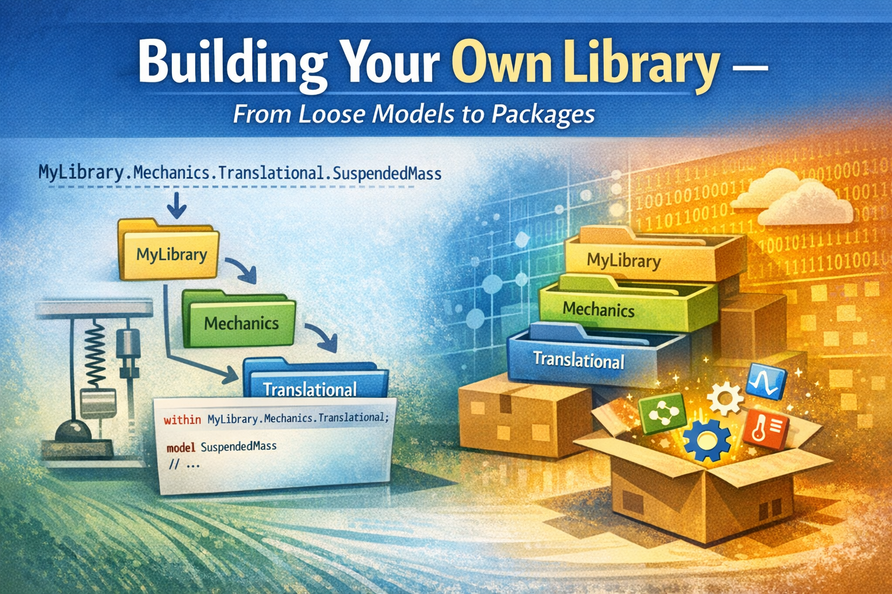
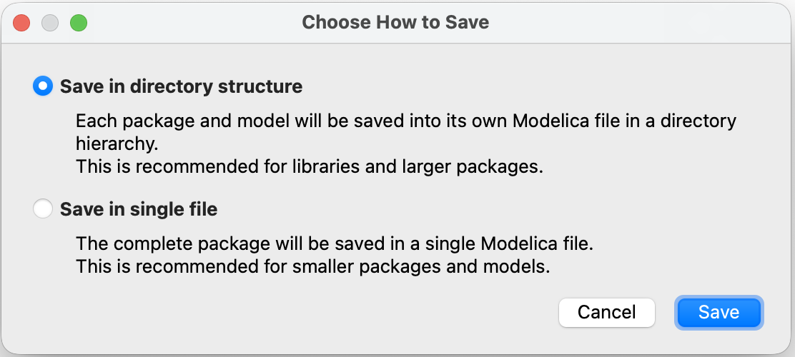
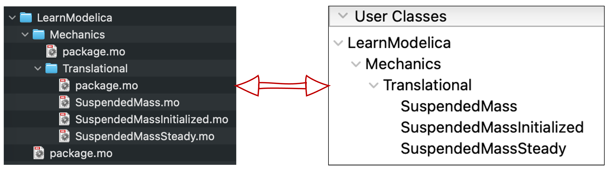

*I hope you've got your preferred drink in hand* ☕️🫖💧

Back in [article 3](./003-FirstModel.qmd), I introduced the MSL as "a package — read 'folder.'" And we've been using dot notation ever since: `Modelica.Units.SI.Temperature`, `Modelica.Constants.g_n`... We never really stopped to think about what those dots mean.

They're addresses. `Modelica.Thermal.HeatTransfer.Components.ThermalConductor` is like `Europe.France.Paris.Arrondissement7.EiffelTower`. Each dot is a level deeper. And the system that makes this work? Packages.

You've been *using* packages since day one. Today, you learn to *build* your own. 📦

## What's a package?

A package in Modelica is exactly what it sounds like: a container for models, connectors, functions, constants, and... other packages. It's the organizational unit of Modelica.

The syntax is straightforward:

```modelica
package MyLibrary "My first Modelica library"
  // Models, sub-packages, constants... go here
end MyLibrary;
```

That's it. `package PackageName` ... `end PackageName;`. If you know how to write a `model`, you know how to write a `package`. The difference? A package *contains* things. A model *does* things.

### Nesting packages

Packages can contain other packages. That's how you create structure:

```modelica
package MyLibrary "My first Modelica library"
  package Mechanics "Mechanical models"
    package Translational "Translational mechanics"
      // Models go here
    end Translational;
  end Mechanics;
end MyLibrary;
```

And *that* is where the dot notation comes from! `MyLibrary.Mechanics.Translational` is the path through nested packages — just like `Europe.France.Paris` is a path through nested locations. Each dot = one level deeper.

Now you understand what `Modelica.Thermal.HeatTransfer.Components.ThermalConductor` means: the `ThermalConductor` model, inside the `Components` package, inside `HeatTransfer`, inside `Thermal`, inside the top-level `Modelica` package (the MSL). 🗺️

### Packages = folders on disk... or not!

Here's something that confused me at first: there are two conventions for writing Modelica libraries, and they look different on disk. But they both represent the same thing: packages.



**Convention 1: Single file** — Everything in one `.mo` file (like our examples above). Simple, but gets unwieldy for large libraries.

**Convention 2: Directory structure** — Each package becomes a folder, with a `package.mo` file inside. This is what real libraries use:

```
MyLibrary/
├── package.mo              ← "package MyLibrary ... end MyLibrary;"
└── Mechanics/
    ├── package.mo           ← "package Mechanics ... end Mechanics;"
    └── Translational/
        ├── package.mo       ← "package Translational ... end Translational;"
        └── SuspendedMass.mo ← our model!
```

Each `package.mo` file contains the package declaration. Each model gets its own `.mo` file inside the folder. Clean, organized, version-control friendly. Modelica packages map directly to your file system.

I will be blunt here: forget the single-file convention. It's fine for tiny examples or for model export/sharing, but real libraries use the directory structure. If you want to build a library that others can use, follow the directory structure convention. It may seem like extra work at first, but it pays off in maintainability and usability, very quickly.

### `within`: the address declaration

When a model lives inside a folder, it needs to declare its address. That's what `within` does:

```modelica
within MyLibrary.Mechanics.Translational;
model SuspendedMass "Suspended mass on a damped spring"
  // ...
end SuspendedMass;
```

The `within` statement at the top says: "I belong to `MyLibrary.Mechanics.Translational`." It's like writing your ZIP code on a letter — it tells the system exactly where this model lives in the package hierarchy.

Without `within`, the tool wouldn't know where to place the model. With it, the model's full address becomes `MyLibrary.Mechanics.Translational.SuspendedMass`. 📬

> 💡 **Bottom line**: Every `.mo` file that lives inside a package folder should start with a `within` clause. The top-level `package.mo` has `within;` (with nothing after it — it's at the root).
> And funny enough, you might never see the `within` keyword! Most tools automatically add it when you create a new model inside a package. It's "hidden" by the tool, and if you open the `.mo` file with a text editor, you'll see it! So it's good to understand what's going on behind the scenes.

## Three flavors of `import`

Writing `Modelica.Units.SI.TranslationalSpringConstant` every time you need a spring stiffness type is... *exhausting*. And we've been doing it since [article 17](./017-BasicCode.qmd). There has to be a better way.

There is. It's called `import`. And it comes in three flavors.

### Flavor 1: Qualified import (the rename)

```modelica
import SI = Modelica.Units.SI;
```

This creates a local shortcut: `SI` now means `Modelica.Units.SI`. You can then write:

```modelica
parameter SI.Mass m = 10;
parameter SI.TranslationalSpringConstant k = 1000;
SI.Position x;
```

Much shorter! You still see *where* things come from (`SI.Something`), but without the full path. It's like saving a bookmark — short name, full address behind the scenes.

### Flavor 2: Single import (the grab)

```modelica
import Modelica.Units.SI.Mass;
import Modelica.Units.SI.Position;
```

This imports individual elements by name. After this, you can write `Mass` and `Position` directly — no prefix needed:

```modelica
parameter Mass m = 10;
Position x;
```

Short and sweet. But you need one import line per element, which can get verbose if you use many types from the same package.

This is actually what we used in [article 17](./017-BasicCode.qmd) for the gravitational constant:

```modelica
import Modelica.Constants.g_n;
```

Which is a special case of single import: importing a constant directly by its full path.

### Flavor 3: Wildcard import (the everything)

```modelica
import Modelica.Units.SI.*;
```

The `.*` grabs *everything* from the package. Now `Mass`, `Position`, `Velocity`, `TranslationalSpringConstant` — all available directly. No prefix, no individual imports.

Sounds convenient, right? It is. But there's a catch: you lose traceability. When you read `Mass` in the code, you have no idea where it came from without checking the import. And if two packages both export a `Mass` type... name collision. 💥

### Which flavor should you use?

| Flavor | Syntax | Readability | Convenience | Risk |
|--------|--------|-------------|-------------|------|
| Qualified | `import SI = Modelica.Units.SI` | ✅ Clear origin | Good shortcut | Low |
| Single | `import Modelica.Units.SI.Mass` | ✅ Direct name | One at a time | Low |
| Wildcard | `import Modelica.Units.SI.*` | ⚠️ Origin unclear | Very convenient | Name collisions |

My recommendation? **Qualified imports for packages, single imports for individual elements.** Use wildcards sparingly — they're tempting but can bite you in larger projects.

> 🤓 **Fun fact**: Imports in Modelica are *local*. They only apply inside the model or package where they're declared. So unlike some programming languages, an import in one model doesn't "leak" into another. Each model is self-contained. Clean!
> But if you use the import at package level, it applies to everything inside that package. So you can have a `package.mo` with imports that all models in that package can use. Handy for common dependencies.

## Building our library

Enough theory. Let's take the models we've built throughout this newsletter and organize them into a proper library. Here's the plan:

We'll create `LearnModelica` — a library containing our suspended mass models from [articles 17](./017-BasicCode.qmd), [18](./018-CodeEnhancement.qmd), and [22](./022-Initialization.qmd).

### The target structure

```
LearnModelica/
├── package.mo
└── Mechanics/
    ├── package.mo
    └── Translational/
        ├── package.mo
        ├── SuspendedMass.mo
        ├── SuspendedMassInitialized.mo
        └── SuspendedMassSteady.mo
```

Three levels of packages, three models. Let's write them.

> You see how the folder structure is subjective? We could have added a `SuspendedMasses` package inside `Translational` to group the variants: `Base, Initialized, Steady`. Or we could have put the steady-state model in a separate `SteadyState` package. There's no right or wrong — just choose what makes sense to you and especially for your users.
> And by the way, I chose this structure to mirror the MSL's structure. For the models of this newsletter, I will have to think further about how to organize them — per domain makes little sense, but maybe per concepts or per complexity level? We'll see.

### The top-level package

`LearnModelica/package.mo`:

```modelica
within;
package LearnModelica "Models from the Learn Modelica & FMI newsletter"
  annotation(Documentation(info="<html>
    <p>A collection of example models built throughout the 
    <a href='https://dr-clementcoic.github.io/LearnModelicaFMI/'>Learn Modelica &amp; FMI</a> newsletter.</p>
    </html>"));
end LearnModelica;
```

Notice `within;` with nothing after it — this is the root package. It has no parent.

### The sub-packages

`LearnModelica/Mechanics/package.mo`:

```modelica
within LearnModelica;
package Mechanics "Mechanical domain models"
end Mechanics;
```

`LearnModelica/Mechanics/Translational/package.mo`:

```modelica
within LearnModelica.Mechanics;
package Translational "Translational mechanics models"
end Translational;
```

See how each `within` reflects the folder structure? `Mechanics` is within `LearnModelica`. `Translational` is within `LearnModelica.Mechanics`. The address matches the location. 📬

### The models

Now our suspended mass from [article 17](./017-BasicCode.qmd) gets a proper home.

`LearnModelica/Mechanics/Translational/SuspendedMass.mo`:

```modelica
within LearnModelica.Mechanics.Translational;
model SuspendedMass "Suspended mass on a damped spring"
  import SI = Modelica.Units.SI;
  import Modelica.Constants.g_n;

  parameter SI.Mass m = 10 "Mass of the suspended body";
  parameter SI.TranslationalSpringConstant k = 1000 "Spring stiffness";
  parameter SI.Length L0 = 1 "Rest length of the spring";
  parameter SI.TranslationalDampingConstant c = 30 "Damping constant";

  SI.Position x "Position of the mass";
  SI.Velocity v "Velocity of the mass";
  SI.Acceleration a "Acceleration of the mass";

equation
  a = -c/m * v - k/m * (x - L0) - g_n;
  a = der(v);
  v = der(x);

end SuspendedMass;
```

Compare this to the version in [article 17](./017-BasicCode.qmd) — same physics, but now with `within`, cleaner `import` statements, and a proper address: `LearnModelica.Mechanics.Translational.SuspendedMass`.

The steady-state variant from [article 18](./018-CodeEnhancement.qmd) goes right next to it in `SuspendedMassSteady.mo` — same `within` clause, same package, different model.



### Maintaining the package order

When you have multiple "things" in a package and want to make sure they are listed in a specific order, there is a way to do it: together with `package.mo`, you can have a `package.order` file. This is a simple text file that lists the names of the "things" in the order you want them to appear in the tool's browser.
We'll skip this for today for conciseness. Yet, feel free to check the MSL's `package.order` files to see how they do it. For example, the top-level packages are organized as per [this file](https://github.com/modelica/ModelicaStandardLibrary/blob/master/Modelica/package.order).

### Using our library

Once the library is loaded in your tool, anyone can use these models:

```modelica
model TestBench
  LearnModelica.Mechanics.Translational.SuspendedMass mass1;
  LearnModelica.Mechanics.Translational.SuspendedMassSteady mass2;
end TestBench;
```

Or with an import:

```modelica
model TestBench
  import LearnModelica.Mechanics.Translational.*;
  SuspendedMass mass1;
  SuspendedMassSteady mass2;
end TestBench;
```

> I used the wildcard import here to show that, when the names of the models are unique, it can be a convenient way to avoid long paths. But as mentioned before, use it with caution — especially in larger libraries where name collisions can happen.

And if you look at the MSL? It's the *exact same pattern*. `Modelica.Mechanics.Translational.Components.Spring` lives in `Modelica/Mechanics/Translational/Components/Spring.mo` with `within Modelica.Mechanics.Translational.Components;` at the top. Our little library follows the same structure as the most widely used Modelica library in the world. Not bad! 😎

> 💡 **Pro tip**: Most Modelica tools have a "New Package" or "New Library" wizard that creates the folder structure and `package.mo` files for you. You don't *have* to do it by hand. But now you understand what the wizard is doing behind the scenes — and you can fix things when they go wrong.

## The END for today

Enough for today. Think about this: the MSL — the library used by thousands of engineers worldwide — follows the exact same structure we just built. Same `package.mo` files. Same `within` clauses. Same `import` statements. The difference? Theirs has a few more models. 😉

And if you want to read more "rigorous" content about this part of the Modelica language, check out the dedicated chapter of the [Modelica Language Specification](https://specification.modelica.org/maint/3.6/packages.html) — it's the official source for all things packages.

You're now equipped to write models, organize them, and share them. Not a bad journey from [that first commitment in article 1](./001-Commitment.qmd).

*Break is over, go back to what you were doing.*

Clem


[Next](./024-Annotations.qmd) ->
