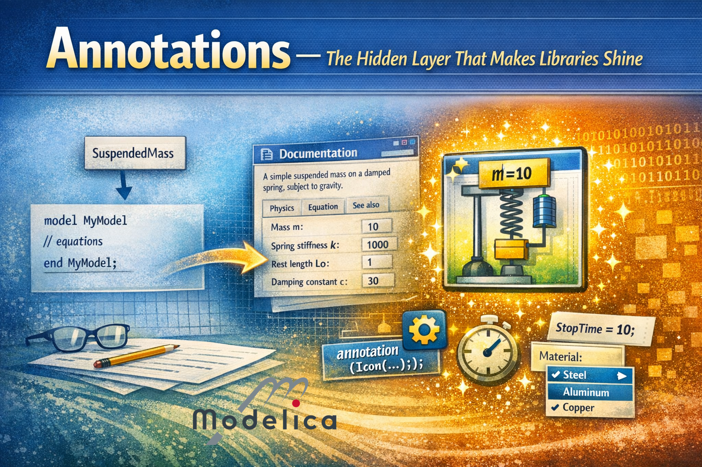
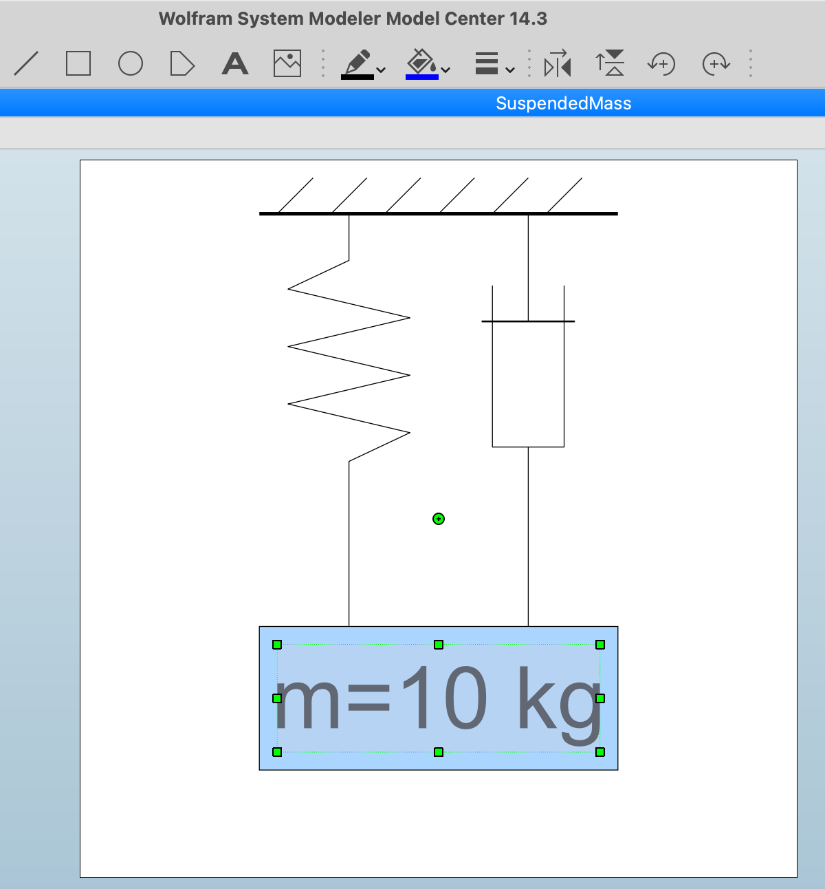
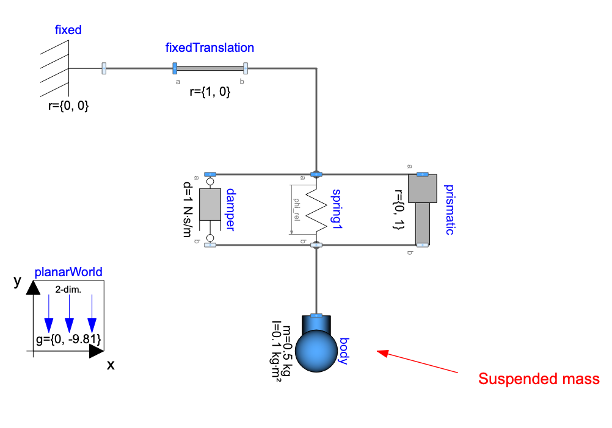
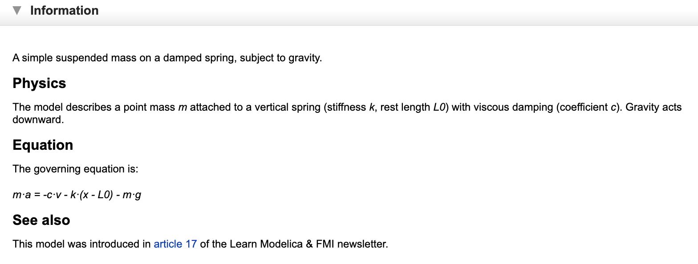
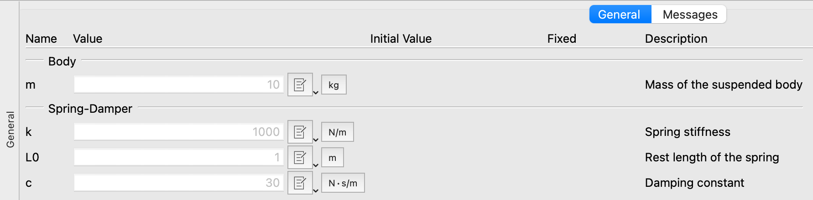

*I hope you've got your preferred drink in hand* ☕️🫖💧

Last week, we [built our own first library](./023-BuildingYourLibrary.qmd). A *working* library. Models, packages, `within` clauses, imports — the whole deal. And it works! ...It just doesn't *look* like much. 😅

Open the MSL and look at any component — beautiful icons, helpful documentation, parameter dialogs with dropdown menus. Open our `SuspendedMass`? A white rectangle with the model name in it. Functional? Yes. Inspiring? Not so much.

Today, we fix that. We learn about *annotations* — Modelica's hidden layer of metadata that turns "it compiles" into "it's a pleasure to use." 💅

## What are annotations, anyway?

Here's the key thing to understand: **annotations don't affect the physics**. Not even a bit! Your model will simulate *exactly* the same way with or without annotations. They're metadata — information *about* the model, not *for* the model.

> Well... that's already wrong! "Good start, Clem..." There are a couple of exceptions that we'll discuss later: annotations for simulations and indirectly the ones for symbolic manipulation and for functions.

Yet, for the most part, annotations are purely cosmetic. They tell the tool how to display your model, how to organize parameters, what documentation to show — but they don't change the equations or the simulation results.

The syntax is simple:

```modelica
annotation(...);
```

That's it. The `annotation` keyword, parentheses, stuff inside, semicolon. And yes, you get it: the secret is in the "stuff" (i.e. "..." in "(...)"). You can attach annotations to pretty much anything: models, packages, components, parameters, connections... They're everywhere. And they're always at the end — after the equations, after the declarations, right before the final `end` or semicolon.

I have introduced annotations quickly in our [suspended mass initialization](./018-CodeEnhancement.qmd). And you've actually been staring at annotations since [article 3](./003-FirstModel.qmd). (Assuming you read the articles. 😉) Every icon you saw when dragging a component from the MSL? Annotation. Every connection line? Annotation. Every help text in a parameter dialog? Annotation. You just never had to care — the tool handled it for you. 🙈

But now you're *building* libraries. And if you want anyone (including future-you) to actually enjoy using your library, you need to write some annotations.

Let's see what we're working with.

## Our starting point: naked models

Remember our `SuspendedMass` [within our library](./023-BuildingYourLibrary.qmd)?

```modelica
within LearnModelica.Mechanics.Translational;
model SuspendedMass "Suspended mass on a damped spring"
  import SI = Modelica.Units.SI;
  import Modelica.Constants.g_n;

  parameter SI.Mass m = 10 "Mass of the suspended body";
  parameter SI.TranslationalSpringConstant k = 1000 "Spring stiffness";
  parameter SI.Length L0 = 1 "Rest length of the spring";
  parameter SI.TranslationalDampingConstant c = 30 "Damping constant";

  SI.Position x "Position of the mass";
  SI.Velocity v "Velocity of the mass";
  SI.Acceleration a "Acceleration of the mass";

equation
  a = -c/m * v - k/m * (x - L0) - g_n;
  a = der(v);
  v = der(x);

end SuspendedMass;
```

The description strings (those `"..."` after each declaration) are actually a form of annotation — they're baked into the Modelica syntax itself. So we're not *completely* naked. But that's about all we've got.

Let's start dressing up. 👔

## Annotation #1: The icon

The most visible annotation (pun intended) is `Icon`. It defines what your model looks like when someone drags it onto a diagram.

```modelica
annotation(Icon(
  coordinateSystem(extent={{-100,-100},{100,100}}),
  graphics={
    Line(points={{-50,85},{50,85}}, color={0,0,0}, thickness=1),
    Line(points={{-45,85},{-35,95}}, color={0,0,0}),
    Line(points={{-30,85},{-20,95}}, color={0,0,0}),
    Line(points={{-15,85},{-5,95}}, color={0,0,0}),
    Line(points={{0,85},{10,95}}, color={0,0,0}),
    Line(points={{15,85},{25,95}}, color={0,0,0}),
    Line(points={{30,85},{40,95}}, color={0,0,0}),
    Line(
      points={{-25,85},{-25,72},{-42,64},{-8,56},
             {-42,48},{-8,40},{-42,32},{-8,24},{-25,16},{-25,-30}},
      color={0,0,0}),
    Line(points={{25,85},{25,55}}, color={0,0,0}),
    Line(points={{12,55},{38,55}}, color={0,0,0}, thickness=0.5),
    Line(points={{15,65},{15,20},{35,20},{35,65}}, color={0,0,0}),
    Line(points={{25,20},{25,-30}}, color={0,0,0}),
    Rectangle(
      extent={{-50,-30},{50,-70}},
      fillColor={170,213,255},
      fillPattern=FillPattern.Solid,
      lineColor={0,0,0}),
    Text(
      extent={{-45,-35},{45,-65}},
      textString="m=%m")
  }
));
```

Okay, that's a lot of curly braces! But at least this one actually looks like a suspended mass. Let me break it down:

- **`coordinateSystem`**: Defines the canvas. `{{-100,-100},{100,100}}` means a 200×200 coordinate space centered at (0,0). This is the standard.
- **`graphics`**: A list of drawing primitives — rectangles, ellipses, lines, text, polygons... you can combine them to create your icon. The primitives are drawn in order, so the wall and hatching come first, then the spring and damper, then the mass rectangle, and finally the text on top.
- **`Rectangle`**: Draws a filled rectangle. `extent` defines two corners, `fillColor` is RGB to define... the color it is filled with 💡, `fillPattern` makes it solid.
- **`Text`**: Displays the text specified as string. `%` is a nice trick that allows substitution of the actual value — here `%m` shows the actual value of parameter `m`. So if someone sets `m=15`, the icon displays `m=15`. Very convenient!
- **`Line`**: Draws lines between points. We use them here for the wall, the hatching, the spring zigzag, and the damper parts (rod, piston, cylinder). Lines are incredibly versatile!

Now here's the good news: **you will almost never write icon annotations by hand**. 😅

Every Modelica tool has a graphical icon editor — you draw your icon with a mouse, and the tool generates the annotation for you. The same way most people don't write SVG by hand, most people don't write `Icon` annotations by hand.

> Spoiler alert: I am NOT an artist! 😅



You see the menu includes the same primitives as the annotation syntax: rectangles, ellipses, lines, polygons, text... You can change colors, line thickness, fill patterns... And when you're done, you save and the tool generates the `Icon` annotation for you.

But understanding the syntax is useful for three reasons:

1. Sometimes you need to *fix* an icon (alignment, color, text substitution) and it's faster to edit the annotation directly than to fight with the graphical editor.
2. You understand what your tool is doing — no more mysterious code blocks at the bottom of your models.
3. You can animate icons with `DynamicSelect`. We won't see that today but it requires you to understand how the icon is built and what you want to change over time (e.g. the position of the rectangle).

### What about `Diagram`?

There's also a `Diagram` annotation that defines what the model looks like when you open it (the internal view with connected components). Same syntax as `Icon`, same graphical primitives. But while `Icon` is what you see from the *outside*, `Diagram` is what you see from the *inside*.

It is seldomly used though. For equation-based models like our `SuspendedMass` (no sub-components), the `Diagram` annotation can be relevant. And when you build models by connecting components — like we did in [article 3](./003-FirstModel.qmd) with the hot beverage model -, every component placement, every connection line, every text label in that diagram define the diagram view, and thus the `Diagram` annotation might not be that much needed. It can however be useful to add some comments on your models and place them in the diagram with the `Diagram` annotation - like I did here on `PlanarMechanics.Examples.SpringDemo` by adding an arrow and a text to show the "suspended mass" part of the model:



## Annotation #2: Documentation

Icons make your model look good in the diagram. Documentation makes it *understandable*.

```modelica
annotation(Documentation(info="<html>
  <p>A simple suspended mass on a damped spring, subject to gravity.</p>
  <h4>Physics</h4>
  <p>The model describes a point mass <i>m</i> attached to a vertical 
  spring (stiffness <i>k</i>, rest length <i>L0</i>) with viscous 
  damping (coefficient <i>c</i>). Gravity acts downward.</p>
  <h4>Equation</h4>
  <p>The governing equation is:</p>
  <p><i>m·a = -c·v - k·(x - L0) - m·g</i></p>
  <h4>See also</h4>
  <p>This model was introduced in 
  <a href='https://dr-clementcoic.github.io/LearnModelicaFMI/017-BasicCode.html'>
  article 17</a> of the Learn Modelica &amp; FMI newsletter.</p>
</html>"));
```

Yes, it's HTML inside a Modelica string. I know. It looks a bit... 1999. (The Modelica specification was written in the 90s, and it shows here. 😉)

But it works! When a user right-clicks on your model and selects "Documentation" (or however your tool calls it), they get a nicely formatted help page with equations, links, and all the info they need to use your model correctly.



A few tips:

- Keep it **concise but complete** — what the model does, what the parameters mean, any assumptions or limitations.
- Use `<h4>` for subsections (not `<h1>` or `<h2>` — those are reserved for the tool's own rendering).
- Add images if relevant! It might be worth a thousand words 😉. You can embed images with `` — just make sure to use relative paths so they work across different machines.
- Add links to related models or external resources.
- There's also a `revisions` field for changelog info: `Documentation(info="...", revisions="<html>...</html>")`. Useful for libraries with version history.

And here again, most tools also have a WYSIWYG (What You See Is What You Get) documentation editor so you don't have to write raw HTML. But again — knowing the syntax means you can fix things when the editor does something weird.

## Annotation #3: Experiment settings

This one is short and sweet. When you simulate a model, you usually want specific settings: stop time, interval, solver, tolerance. You can embed these as defaults:

```modelica
annotation(experiment(
  StopTime=10,
  Interval=0.01,
  Tolerance=1e-6
));
```

When someone opens your model and hits "Simulate," these values will be pre-filled. No more guessing "what stop time should I use?" — the model tells you.

This is especially useful for example models and test cases. You're essentially saying: "here's how I intended this model to be simulated."

> 💡 **Remember**: These are *defaults*, not *constraints*. Users can always change them. You're just saving them the hassle of figuring it out.

I had mentioned there are some exceptions to the "Your model will simulate *exactly* the same way with or without annotations" rule. This is one of them obviously. The `experiment` annotation does affect the simulation, but only in the sense that it provides default solver settings. It doesn't change the equations or the model's behavior.

## Annotation #4: Parameter dialogs with `Dialog`

Now we're getting into the "quality of life" territory. When you have a model with many parameters, the default parameter dialog is just a flat list. Not great for usability.

The `Dialog` annotation lets you organize parameters into tabs and groups:

```modelica
parameter SI.Mass m = 10 "Mass of the suspended body"
  annotation(Dialog(tab="General", group="Body"));
parameter SI.TranslationalSpringConstant k = 1000 "Spring stiffness"
  annotation(Dialog(tab="General", group="Spring-Damper"));
parameter SI.Length L0 = 1 "Rest length of the spring"
  annotation(Dialog(tab="General", group="Spring-Damper"));
parameter SI.TranslationalDampingConstant c = 30 "Damping constant"
  annotation(Dialog(tab="General", group="Spring-Damper"));
```

Now when a user double-clicks the component, they see organized parameters:

- **Tab: General**
  - **Group: Body** → `m`
  - **Group: Spring-Damper** → `k`, `L0`, `c`



With 4 parameters, this is nice but not critical. With 30 parameters? This is the difference between "usable" and "I give up." Open any MSL component — `Modelica.Fluid.Pipes.DynamicPipe`, for instance — and check how its parameters are organized. That's `Dialog` at work.

### The `Evaluate` annotation

Quick bonus: want a parameter to be evaluated at compile time (making the simulation faster but requiring recompilation if the user wants to change its value)?

```modelica
parameter Integer n = 10 "Number of elements"
  annotation(Evaluate=true);
```

This tells the tool: "treat `n` as a constant during compilation." 

Useful tip: you can, in many tools, have `annotation(Evaluate=condition)` where `condition` is a boolean expression. This allows you to make the evaluation conditional on other parameters or settings - which can be very convenient to set up a flag for "fast simulation mode" vs "detailed simulation mode" for instance.

## Annotation #5: Choices

One more gem before we wrap up. The `choices` annotation provides a dropdown menu for parameters — particularly powerful with [replaceable models](./012-ReplaceableModels.qmd):

```modelica
replaceable model Material = Steel
  constrainedby BaseMaterial "Select material"
  annotation(choices(
    choice(redeclare model Material = Steel "Steel"),
    choice(redeclare model Material = Aluminum "Aluminum"),
    choice(redeclare model Material = Copper "Copper")
  ));
```

Remember replaceable models from [article 12](./012-ReplaceableModels.qmd)? We talked about how they let users swap components. The `choices` annotation makes this *discoverable* — instead of requiring users to know which models are available, they get a dropdown. Click, select, done. ✅

> To have all choices appear in the dropdown menu, use `annotation(choicesAllMatching = true)`.

You can also use `choices` for simple parameters:

```modelica
parameter String material = "Steel" "Material name"
  annotation(choices(
    choice="Steel",
    choice="Aluminum",
    choice="Copper"
  ));
```

## Putting it all together

Let's apply everything to our `SuspendedMass`. Here's the "after" version:

```modelica
within LearnModelica.Mechanics.Translational;
model SuspendedMass "Suspended mass on a damped spring"
  import SI = Modelica.Units.SI;
  import Modelica.Constants.g_n;

  parameter SI.Mass m = 10 "Mass of the suspended body"
    annotation(Dialog(tab="General", group="Body"));
  parameter SI.TranslationalSpringConstant k = 1000 "Spring stiffness"
    annotation(Dialog(tab="General", group="Spring-Damper"));
  parameter SI.Length L0 = 1 "Rest length of the spring"
    annotation(Dialog(tab="General", group="Spring-Damper"));
  parameter SI.TranslationalDampingConstant c = 30 "Damping constant"
    annotation(Dialog(tab="General", group="Spring-Damper"));

  SI.Position x "Position of the mass";
  SI.Velocity v "Velocity of the mass";
  SI.Acceleration a "Acceleration of the mass";

equation
  a = -c/m * v - k/m * (x - L0) - g_n;
  a = der(v);
  v = der(x);

  annotation(
    Documentation(info="<html>
      <p>A simple suspended mass on a damped spring, subject to gravity.</p>
      <h4>Physics</h4>
      <p>The model describes a point mass <i>m</i> attached to a vertical 
      spring (stiffness <i>k</i>, rest length <i>L0</i>) with viscous 
      damping (coefficient <i>c</i>). Gravity acts downward.</p>
      <h4>Equation</h4>
      <p>The governing equation is:</p>
      <p><i>m·a = -c·v - k·(x - L0) - m·g</i></p>
      <h4>See also</h4>
      <p>This model was introduced in 
      <a href='https://dr-clementcoic.github.io/LearnModelicaFMI/017-BasicCode.html'>
      article 17</a> of the Learn Modelica &amp; FMI newsletter.</p>
    </html>"),
    experiment(StopTime=10, Interval=0.01, Tolerance=1e-6),
    Icon(
      coordinateSystem(extent={{-100,-100},{100,100}}),
      graphics={
        Line(points={{-50,85},{50,85}}, color={0,0,0}, thickness=1),
        Line(points={{-45,85},{-35,95}}, color={0,0,0}),
        Line(points={{-30,85},{-20,95}}, color={0,0,0}),
        Line(points={{-15,85},{-5,95}}, color={0,0,0}),
        Line(points={{0,85},{10,95}}, color={0,0,0}),
        Line(points={{15,85},{25,95}}, color={0,0,0}),
        Line(points={{30,85},{40,95}}, color={0,0,0}),
        Line(
          points={{-25,85},{-25,72},{-42,64},{-8,56},
                 {-42,48},{-8,40},{-42,32},{-8,24},{-25,16},{-25,-30}},
          color={0,0,0}),
        Line(points={{25,85},{25,55}}, color={0,0,0}),
        Line(points={{12,55},{38,55}}, color={0,0,0}, thickness=0.5),
        Line(points={{15,65},{15,20},{35,20},{35,65}}, color={0,0,0}),
        Line(points={{25,20},{25,-30}}, color={0,0,0}),
        Rectangle(
          extent={{-50,-30},{50,-70}},
          fillColor={170,213,255},
          fillPattern=FillPattern.Solid,
          lineColor={0,0,0}),
        Text(
          extent={{-45,-35},{45,-65}},
          textString="m=%m")
      }));
end SuspendedMass;
```

Same physics. Same equations. Same simulation results. But now it has:

- ✅ An icon that shows what it is
- ✅ Documentation that explains what it does
- ✅ Experiment settings so users know how to simulate it
- ✅ Organized parameter dialogs

From "white rectangle" to "professional component." Not bad for a few extra lines of metadata. 😎

### And the package too!

Don't forget the package itself. Our top-level `LearnModelica/package.mo` from [last time](./023-BuildingYourLibrary.qmd) already had a `Documentation` annotation. But you can also add version info:

```modelica
within;
package LearnModelica "Models from the Learn Modelica & FMI newsletter"
  annotation(
    version="0.1.0",
    Documentation(info="<html>
      <p>A collection of example models built throughout the 
      <a href='https://dr-clementcoic.github.io/LearnModelicaFMI/'>
      Learn Modelica &amp; FMI</a> newsletter.</p>
      </html>"));
end LearnModelica;
```

The `version` annotation is how Modelica tools track library versions and dependencies. When library A `uses` library B, the `uses` annotation records which version of B was expected:

```modelica
annotation(uses(Modelica(version="4.0.0")));
```

This is how your tool knows to warn you when you're using a model built against a different version of a dependency. Version management for free. 📦

## A quick reference card

Here's a cheat sheet of the annotations we covered today:

| Annotation | What it does | Applies to |
|------------|-------------|------------|
| `Icon(...)` | Defines the external graphical appearance | Models, packages |
| `Diagram(...)` | Defines the internal diagram layout | Models |
| `Documentation(info="...")` | HTML help text | Models, packages, connectors |
| `experiment(...)` | Default simulation settings | Models |
| `Dialog(tab=..., group=...)` | Organizes parameter dialogs | Parameters |
| `Evaluate=true` | Compile-time constant | Parameters |
| `choices(...)` | Dropdown selection menu | Parameters, replaceable |
| `version="..."` | Library version tracking | Packages |
| `uses(...)` | Dependency declaration | Packages |

And there are more — `Placement` (where a component sits in the diagram), `Line` (how connections are routed), `defaultComponentName`, `defaultComponentPrefixes`... We'll encounter some of these as we keep building models.

> 💡 If you want the exhaustive list, the [Modelica Language Specification](https://specification.modelica.org/maint/3.6/annotations.html) has a dedicated chapter on annotations. But honestly? The ones in the table above will cover 90% of what you need.

## The END for today

Enough for today. Your library now has structure AND style. Packages from [last time](./023-BuildingYourLibrary.qmd), annotations from today — you've got a library that's not just correct, but *pleasant to use*.

You also saw that all these annotations can pretty much crowd your model code. That's why most tools can collapse annotations into a single block at the end of the model. It keeps your code clean and lets you focus on the equations when you want to.

Next time, we tackle something completely different: **what happens when things change abruptly?** Your solver happily integrates smooth differential equations... until a thermostat switches, a ball bounces, or a valve slams shut. Welcome to the world of events. 🤯

*Break is over, go back to what you were doing.*

Clem


[Next](./025-Events.qmd) ->
