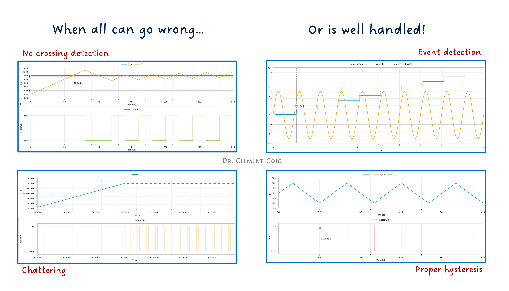
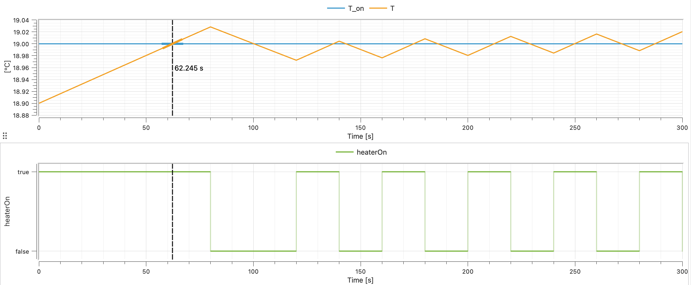
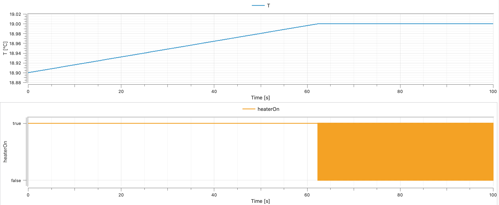
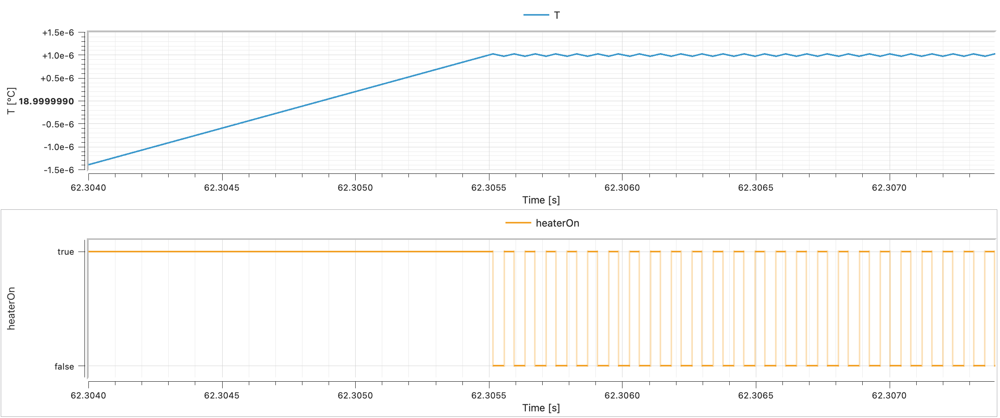
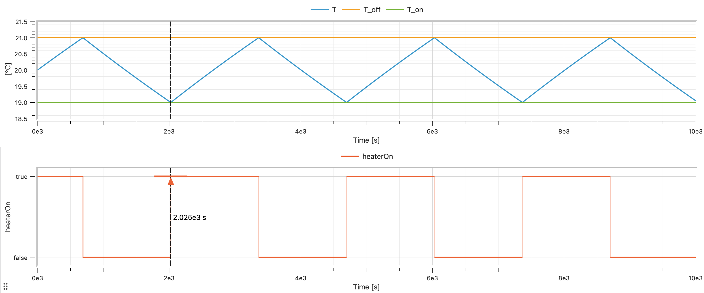
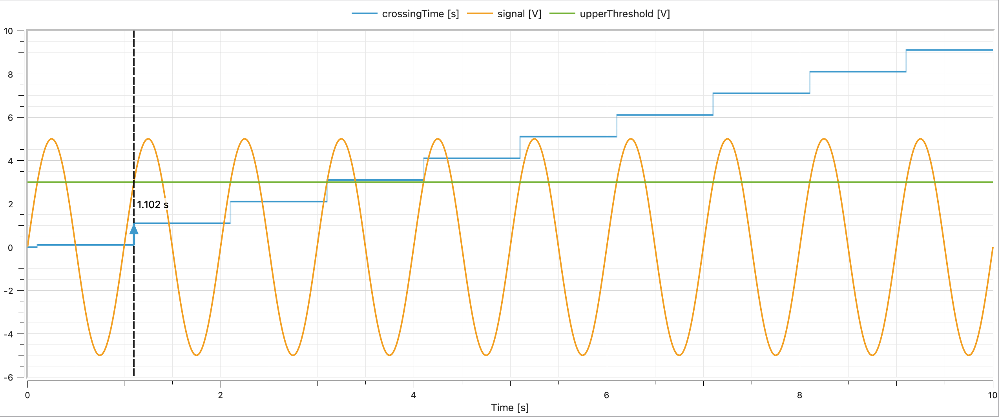
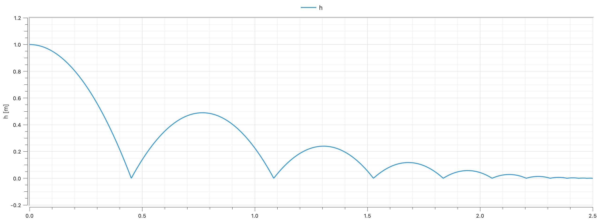

*I hope you've got your preferred drink in hand* ☕️🫖💧

Remember [articles 9 to 11](./009-NeedForDynamicSimulation.qmd)? We learned that solvers integrate differential equations — smooth, continuous, well-behaved equations. We even built a nice oscillating mass that swings back and forth *forever*, smooth as butter.

Real life is not that polite. 😅

Thermostats switch on and off. Balls hit the ground and bounce. Valves open and close. Engines start and stop. The physical world is full of *discontinuities* — moments when things change abruptly, violently, *instantly*. And your smooth differential equations? They have no idea what to do with that! So far...

Today, we learn how Modelica handles "the mess" 😅.

## The problem: smooth solvers, rough world

Let's set the stage. Your ODE solver (the thing that does the time-stepping, remember [article 10](./010-WhatDynamicSimulationDoes.qmd)?) works beautifully under one assumption: **the equations are smooth**. Meaning: the right-hand side of your differential equations is continuous, and ideally differentiable. The solver predicts the next step based on the current trajectory — extrapolation, polynomials, all very elegant.

Now imagine you're simulating a heated room:

```
if temperature < 19 then
  heaterPower = 3000;    // ON
else
  heaterPower = 0;        // OFF
end if;
```

At 18.9°C, the heater pumps 1000 W. At 19.03°C, it delivers 0 W. The power jumps from 1000 to 0 in an instant. That jump — that *discontinuity* — is invisible to a solver that assumes smoothness. The solver might step right over the switching point, from 18.5°C to 19.5°C, and never notice anything happened before 19.5°C. But wait! You specified that the heater should be OFF from 19°C and onward. The solver just ignored that!



> I tricked the solver into missing the switch by using a large step size. 😉 I know, I am mean. But this is to show you the problem. And you might actually face it without enforcing it at some point!

Or worse: it *does* notice, gets confused by the sudden change, shrinks its step size to microscopic levels, and your simulation grinds to a halt. 🐌 Then the heater power is set to 0, the rooms starts to cool down a tiny bit to 18.9999°C, the heater turns back on, the temperature jumps back up to 19.0001°C, and you get infinite switching — *chattering* — until your computer overheats. 🔥 (... which might warm the room and not require a heater anymore 😉.)



Now you can say you don't see the "chattering" in the plot. Only a big orange square appearing... It is the fast switching happening in a very short time interval. Let's zoom in:



This is the fundamental tension: **physics is sometimes discontinuous, but solvers need smoothness**. Modelica's answer? **Events**.

## Events: the solver's safety mechanism

An *event* in Modelica is a precisely detected instant where something discrete happens. The key insight: **the solver doesn't handle the discontinuity — it stops** ***before*** **it, handles the switch, then restarts.**

Here's the sequence:

1. **Continuous integration** — The solver happily integrates smooth equations, step by step.
2. **Zero crossing detected** — A monitored condition (like `temperature - 19`) changes sign between two steps. The solver realizes: "something happened in this interval!"
3. **Bisection** — The solver backtracks and narrows down the exact instant when the condition occurs ("zero crossing"). (Binary search, essentially.)
4. **Event iteration** — Time freezes. The discrete changes are applied (heater switches). All equations are re-evaluated. If the changes trigger *more* events, those are handled too — still at the same instant.
5. **Restart** — The solver restarts with the new, updated equations. Smooth sailing again... until the next event.

This is why Modelica simulations can handle switches, bounces, and limits without blowing up. The solver is never asked to integrate *through* a discontinuity — it always integrates smooth segments *between* events. Pretty clever. 🧠

> 💡 The technical term for this is **hybrid simulation** — a mix of continuous-time integration and discrete-event handling. It's one of the things that sets Modelica apart from pure continuous simulation tools.

And [here](https://www.linkedin.com/posts/clementcoic_%F0%9D%97%AA%F0%9D%97%B5%F0%9D%97%AE%F0%9D%98%81-%F0%9D%97%B1%F0%9D%97%BC%F0%9D%97%B2%F0%9D%98%80-%F0%9D%97%9B%F0%9D%98%86%F0%9D%97%AF%F0%9D%97%BF%F0%9D%97%B6%F0%9D%97%B1-%F0%9D%97%A0%F0%9D%97%BC%F0%9D%97%B1%F0%9D%97%B2%F0%9D%97%B9-activity-7366072424695508992-01ue?utm_source=share&utm_medium=member_desktop&rcm=ACoAAAvWVZ0BZbEQgBl-D48t8gE2mzK-oPL3yY4) is a note about hybrid modeling by the way. 😊

## `if` in equations: choosing between behaviors

The simplest way to create an event is with `if` in the equation section. We actually sneaked a peek at this in [article 18](./018-CodeEnhancement.qmd), but let's look at it properly now.

```modelica
model HeatedRoom "Room with on/off thermostat"
  import SI = Modelica.Units.SI;

  parameter SI.Temperature T_on = 292.15 "Heater ON below this (19°C)" annotation(Evaluate = false);
  parameter SI.Temperature T_off = 294.15 "Heater OFF above this (21°C)";
  parameter SI.HeatCapacity C = 500000 "Room heat capacity";
  parameter SI.ThermalConductance G = 50 "Heat loss to outside";
  parameter SI.Power Q_heater = 1500 "Heater power when ON";
  parameter SI.Temperature T_outside = 278.15 "Outside temperature (5°C)";

  SI.Temperature T(start=293.15) "Room temperature";
  Boolean heaterOn(start=true) "Heater state";

equation
  // Thermostat logic with hysteresis
  when T < T_on then
    heaterOn = true;
  elsewhen T > T_off then
    heaterOn = false;
  end when;

  // Energy balance
  C * der(T) = (if heaterOn then Q_heater else 0) - G * (T - T_outside);

  annotation(
    experiment(
      StopTime = 10000.0
    )
  );
end HeatedRoom;
```

A few things to notice:

**The `when` clause** handles the switching logic (we'll get to `when` properly in a moment). It generates events when the temperature crosses the thresholds.

**The `if` expression** inside the energy balance equation (`if heaterOn then Q_heater else 0`) selects the heater power based on the current state. This is an `if` *expression* (inline, inside an equation), not an `if` *equation* (with its own equation block). Both exist in Modelica — and they behave differently with respect to events. More on that in a moment.

**The hysteresis** (ON below 19°C, OFF above 21°C) prevents the thermostat from chattering endlessly at a single threshold. This is not just a modeling trick — it's how real thermostats work. Without hysteresis, you'd get infinitely fast on-off-on-off switching at exactly 19°C. Not fun for your solver, not fun for your heater. 😵‍💫



Beautiful curves, right?

## `when`: reacting to specific instants

`when` is the star of Modelica's event system. It defines actions that happen at *specific instants* — not continuously, not repeatedly, just *once* when a condition becomes true.

```modelica
when condition then
  // These equations are activated at the instant
  // when 'condition' becomes true
end when;
```

Key rules for `when`:

1. **Triggered on rising edge only.** A `when` fires when its condition changes from `false` to `true`. Not while it stays true. Not when it becomes false. Only the transition `false → true`.
2. **Equations inside `when` are discrete.** They're not part of the continuous equation system. They execute once, at the event instant.
3. **You can have `elsewhen`.** Multiple conditions, checked in order.

Here's a simple example — a timer that logs when a threshold is crossed:

```modelica
model ThresholdDetector
  import SI = Modelica.Units.SI;
  import Modelica.Constants.pi;

  parameter SI.Voltage upperThreshold = 3 "Upper threshold value" annotation(Evaluate = false);
  SI.Voltage signal = 5 * sin(2 * pi * time);
  SI.Time crossingTime "Time when signal exceeds threshold";

equation
  when signal > upperThreshold then
    crossingTime = time;
  end when;

end ThresholdDetector;
```



Every time `signal` rises past 3.0 V, `crossingTime` is updated to the current time. When `signal` drops below 3.0 V? Nothing happens — `when` only fires on the *rising edge*.

### `when` vs `if` — the crucial difference

This confuses everyone at first (it confused me 🙋), so let's be very explicit:

| | `if` equation | `when` equation |
|---|---|---|
| **Activation** | Active whenever condition is true | Fires once when condition *becomes* true |
| **Duration** | Continuous — holds as long as true | Instantaneous — executes at the event instant |
| **Equations** | Continuous equations | Discrete assignments |
| **Use for** | Switching between equation regimes | Triggering instantaneous actions |

An `if` equation says: "while this is true, use these equations." A `when` equation says: "at the exact moment this becomes true, do this."

## `reinit()`: resetting the clock

Now for the fun one. Sometimes, at an event instant, you need to *reset* a continuous state variable to a new value. That's what `reinit()` does.

The classic example: a bouncing ball.

```modelica
model BouncingBall "Ball bouncing on the floor"
  import SI = Modelica.Units.SI;
  import Modelica.Constants.g_n;

  parameter Real e = 0.7 "Coefficient of restitution";

  SI.Height h(start=1.0, fixed=true) "Height above ground";
  SI.Velocity v(start=0.0, fixed=true) "Vertical velocity";

equation
  der(h) = v;
  der(v) = -g_n;

  when h < 0 then
    reinit(v, -e * pre(v));
  end when;

end BouncingBall;
```

Let's walk through this:

1. **Free fall**: `der(v) = -g_n` — the ball accelerates downward. `der(h) = v` — its height changes with velocity. Smooth, continuous, the solver is happy.
2. **Impact detection**: `when h < 0` — when the height crosses zero (the floor), an event fires.
3. **Velocity reset**: `reinit(v, -e * pre(v))` — the velocity is instantly set to `-e` times its value just *before* the event. If it was falling at -5 m/s, it's now rising at 3.5 m/s (with `e=0.7`).
4. **Restart**: The solver restarts from the new state. The ball goes up, slows down, comes back down, bounces again...



### What's `pre()`?

You noticed `pre(v)` in the `reinit` call. `pre()` gives you the value of a variable *just before* the current event. It's essential inside `when` clauses because during event iteration, variables might already have been updated. `pre()` says: "give me what this was *before* everything started changing."

Think of it as a snapshot: `pre(v)` is the velocity the instant before the ball hits the ground. Without `pre()`, you'd risk using a value that's already been modified by the event — leading to incorrect (or infinite) bouncing.

> 🤓 `pre()` only makes sense for discrete variables and inside `when` clauses. Don't use it on continuous variables outside of events — it has no meaning there.

## `if` equations vs `if` expressions — round 2

I promised to come back to this, so here we go. Modelica has *two* kinds of `if`:

### `if` equations (full blocks)

```modelica
equation
  if condition then
    a = expr1;
    b = expr2;
  else
    a = expr3;
    b = expr4;
  end if;
```

These switch between *sets of equations*. Important rules:

- **Same number of equations** in each branch. The system must remain balanced (remember [article 22](./022-Initialization.qmd) and square systems?).
- **Same variables** must be solved in each branch.
- The condition *generates events* — the solver detects when it changes and handles the switch cleanly.

### `if` expressions (inline)

```modelica
equation
  a = if condition then expr1 else expr2;
```

These are just conditional values inside an equation. One equation, two possible right-hand sides. Also generates events.

### When you *don't* want events: `noEvent()`

Sometimes an `if` expression represents a *smooth* transition that doesn't need event detection. For instance:

```modelica
y = if x > 0 then x^2 else 0;
```

Mathematically, this is continuous (and even differentiable) at `x = 0`. There's no real discontinuity — both sides meet smoothly at zero. But Modelica will still generate an event when `x` crosses zero, because it sees an `if` with a condition. Unnecessary work.

Enter `noEvent()`:

```modelica
y = noEvent(if x > 0 then x^2 else 0);
```

This tells the solver: "don't bother detecting events here. Just evaluate the expression directly." The solver won't stop for bisection or event iteration — it'll integrate right through the crossing.

Use `noEvent()` when:

- The expression is continuous regardless of the condition.
- You want to avoid unnecessary event overhead.
- You know the discontinuity (if any) is small enough that the solver can handle it.
- You don't care about the exact instant of crossing, just the overall behavior.

**Don't** use `noEvent()` when:

- There's a real discontinuity (like a thermostat switch).
- The solver needs to detect the crossing for physical correctness.
- You're not sure (when in doubt, let events happen).

> ⚠️ Using `noEvent()` incorrectly can lead to wrong results. The solver might step right over a discontinuity and produce nonsensical values. For example, you could think of saturating absolute pressures with a minimum of zero, and if the solver ignores the event, you might get negative pressures... which is physically impossible for an ABSOLUTE pressure. So all in all, use it with care. :)

## A quick reference card

| Keyword/Function | What it does | When to use |
|---|---|---|
| `when ... then` | Fire actions at a specific instant | Discrete state changes, triggers |
| `elsewhen` | Additional event conditions | Multiple trigger conditions |
| `if ... then` (equation) | Switch between equation sets | Different physics regimes |
| `if ... then` (expression) | Conditional value in an equation | Inline switching |
| `reinit(x, value)` | Reset a state variable at an event | Bounces, resets, sudden changes |
| `pre(x)` | Value just before the current event | Inside `when` to access pre-event state |
| `noEvent(expr)` | Suppress event generation | Smooth expressions that don't need events |

## The END for today

Enough for today. Events are one of those topics that sound complicated in theory but become intuitive once you see them in action. The bouncing ball, the thermostat — these are textbook examples, but the same mechanisms power complex industrial models: clutch engagement in drivetrains, pressure relief valves in hydraulics, breaker trips in electrical grids...

The key takeaway: **Modelica separates smooth physics from discrete logic, and events are the bridge.** The solver handles the smooth parts, events handle the jumps, and `reinit()` stitches them together.

*Break is over, go back to what you were doing.*

Clem


[Next](./026-EventsInFMUs.qmd) ->
