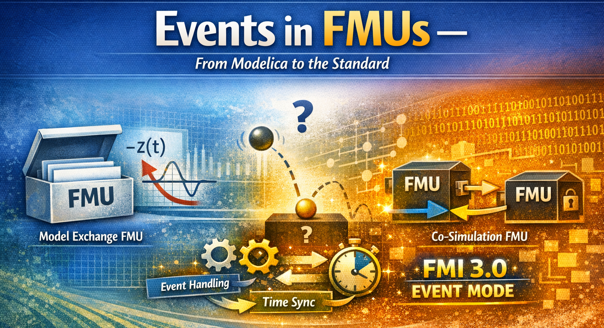
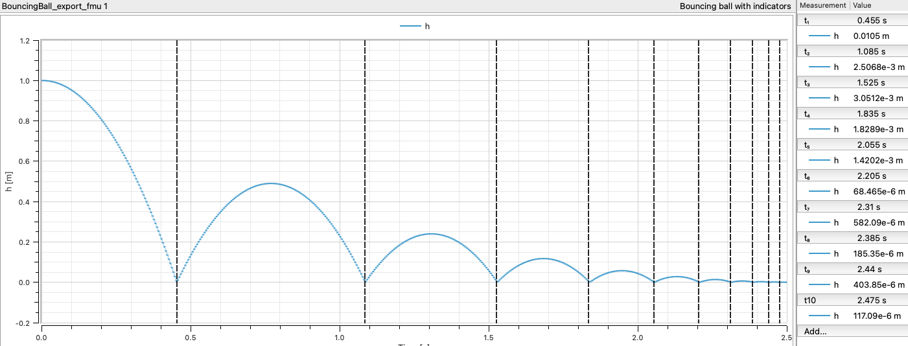
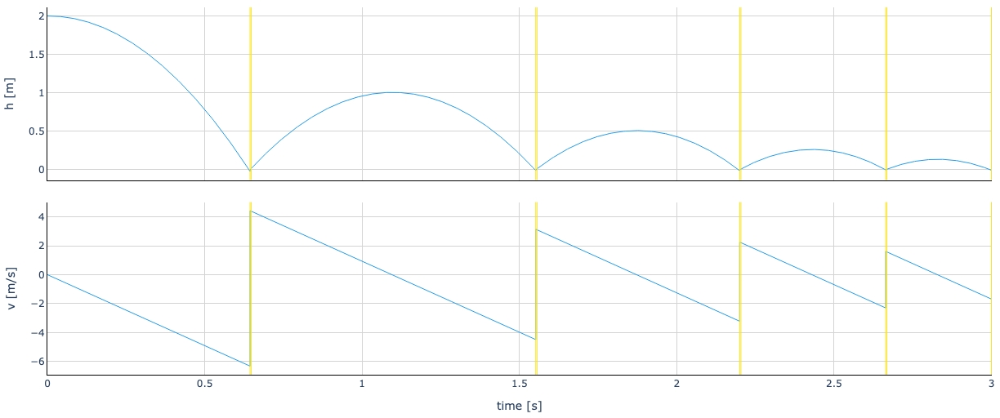

*I hope you've got your preferred drink in hand* ☕️🫖💧

Remember [last time](./025-Events.qmd)? We learned how Modelica handles events — zero crossings, `when` clauses, bouncing balls, the whole Event management.

Well, Christian Bertsch — project leader of the FMI standard (no less 😉) — read that article and basically said: *"Great, Clem. But what happens to those events when you export your model as an FMU?"* (I'm paraphrasing, but you get the idea 😅.)

And honestly? That's a *great* question. Because the answer is: **it depends on the type of FMU.** And the differences are... significant.

Today, we follow our beloved events on their journey from Modelica to FMI. Buckle up.

## Quick recap: what's an event?

I won't redo the full lecture — you just read [the article](./025-Events.qmd) (right? RIGHT?! 😉). But let's refresh the essentials in FMI-friendly vocabulary:

- **Event indicators** are continuous functions whose sign changes indicate that something discrete needs to happen. In Modelica, these come from conditions in `when` and `if` clauses. When the sign flips, the solver knows: *"something happened here, I need to stop and deal with it."*
- **Event handling** is the process of freezing time, applying discrete changes (like `reinit()`, thermostat switches, etc.), and re-evaluating the equations until everything is consistent.
- **After the event**, the solver restarts with the new state. Smooth sailing again — until the next event.

In your Modelica tool, all of this is handled *internally*. The tool compiles the model, generates event indicators, and manages the whole event detection + handling loop. You don't see any of it (unless you go digging in solver logs 🤓).

But when you export that model as an FMU... who does all this work? That depends on **where the solver lives**. And if you remember [article 16](./016-MEvsCS.qmd), you know the answer to that question is different for Model Exchange and Co-Simulation.

## Events in Model Exchange FMUs

Remember the key difference from [article 16](./016-MEvsCS.qmd)? In Model Exchange, **the FMU has no solver**. It exposes the raw equations — derivatives, algebraic relations, and yes, *event indicators* — and the importer's solver does all the heavy lifting.

This is great news for events. Here's why.

### The FMU exposes its event indicators

When a Modelica tool exports a model as a Model Exchange FMU, it translates all those `when` conditions and `if` clauses into **event indicator functions**. These are continuous functions $z_j(t)$ that the FMU can compute at any time. An event is signaled by a *domain change*: $z_j$ going from positive to negative (or vice versa).

Sound familiar? It should — that's essentially what your Modelica tool was doing internally (we covered zero-crossings in [article 25](./025-Events.qmd)). The difference is: now those zero-crossing functions are *exposed* to the outside world through the FMI API.

The importer can call `fmi3GetEventIndicators()` at any point during integration and get back a vector of values. If any sign has flipped since the last check — boom, state event detected.

### The importer runs the show

Here's how the event handling loop works in ME. It's exactly what we described in [article 25](./025-Events.qmd), but now split across two parties — the FMU and the importer:

1. **Continuous integration** — The importer advances time, sets states, gets derivatives from the FMU. Business as usual.
2. **Event indicator check** — After each step, the importer calls `fmi3GetEventIndicators()` and compares signs with the previous step.
3. **Bisection** — If a sign changed, the importer narrows down the exact crossing time. (The importer does this — not the FMU!)
4. **Enter Event Mode** — The importer calls `fmi3EnterEventMode()`. Time freezes.
5. **Event iteration** — The importer calls `fmi3UpdateDiscreteStates()` in a loop. The FMU updates its discrete variables, applies `reinit()` if needed, and reports back: *"I need another iteration"* or *"I'm done."*
6. **Restart** — The importer calls `fmi3EnterContinuousTimeMode()` and resumes integration with the updated state.

The beauty of ME: **nothing is hidden**. The importer sees every event indicator, controls every bisection step, and decides when to enter and leave Event Mode. Full transparency. Full control.

The price? The importer has to *implement* all of this. Not every importer is created equal — a sophisticated one handles events beautifully, a simple one might struggle. But the information is there for the taking.

> 💡 If your Modelica model uses `reinit()` (like our bouncing ball), the FMU tells the importer that state values changed during Event Mode. The importer must then fetch the new states before restarting. It's all explicit — no surprises.

### In short

Model Exchange FMUs treat events the same way a Modelica tool does internally — they just split the responsibilities. The FMU provides the math (derivatives, event indicators, discrete updates). The importer provides the brains (integration, bisection, event orchestration).

Think of it this way: **ME gives you all the ingredients and the recipe. You do the cooking.** 🧑‍🍳

## Events in Co-Simulation FMUs

Co-Simulation is a different beast. Remember: **the FMU brings its own solver**. The importer just says *"go from time $t$ to time $t + h$"* by calling `fmi3DoStep()`, and the FMU figures out everything internally — integration, event detection, event handling, all of it.

This simplicity is both the strength and the weakness of Co-Simulation when it comes to events.

### The classic problem: hidden events

In a basic Co-Simulation setup (the kind we had in FMI 2.0), the importer has **zero visibility** into what happens inside `fmi3DoStep()`. The FMU steps from one communication point to the next, and the importer only sees the outputs at those communication points.

So what happens when the bouncing ball hits the floor *between* two communication points?

The FMU might handle the bounce internally — it has its own solver after all. But the importer doesn't know the bounce happened. The outputs it gets are at the communication points *before* and *after* the bounce. If the communication step is too large, the trajectory looks weird. The ball might appear to go *through* the floor for an instant, or the bounce might seem to happen at the wrong time or height - not on the floor as shown here:

It's not that the events didn't happen — they did, *inside* the FMU. But the importer couldn't react to them. It couldn't adjust its communication step. It couldn't synchronize with other FMUs that might need to know about the bounce. The events were there, but trapped in a black box. 📦

> This is fine if you're simulating a single FMU and you only care about the outputs at communication points. But in a multi-FMU co-simulation? When FMU A bounces and FMU B needs to know *exactly when*? That's where things get... painful. 😅

### FMI 3.0 to the rescue: Event Mode for Co-Simulation

This is what Christian was talking about: **hybrid co-simulation**. FMI 3.0 introduced Event Mode for Co-Simulation FMUs, and it changes the game.

The idea: the CS FMU can now *signal* to the importer that something happened during `fmi3DoStep()`, and the importer can *enter Event Mode* to handle it — just like in Model Exchange.

Here's how it works:

**Step 1: The FMU announces support.** In the `modelDescription.xml`, the FMU sets `hasEventMode = true`. This tells the importer: *"I know what Event Mode is, and I can use it."*

**Step 2: The importer opts in.** When instantiating, the importer sets `eventModeUsed = fmi3True`. Both parties have agreed: events will be a cooperative effort.

**Step 3: During `fmi3DoStep()`, the FMU detects an event.** Instead of silently handling it internally, the FMU *returns early*. It sets `eventHandlingNeeded = fmi3True` and reports the exact time of the event in `lastSuccessfulTime`.

**Step 4: The importer enters Event Mode.** It calls `fmi3EnterEventMode()`, applies any discrete input changes, and iterates with `fmi3UpdateDiscreteStates()` — just like it would in Model Exchange.

**Step 5: Back to stepping.** After the event is handled, the importer calls `fmi3EnterStepMode()` and resumes `fmi3DoStep()` from where the FMU left off.

The result? The bouncing ball works properly, even in Co-Simulation:

The importer sees *exactly* when the ball bounces, can record the output just before and after, and can synchronize the event with other FMUs. The black box just got a window. 🪟

### What about early return without Event Mode?

FMI 3.0 actually offers a middle ground too. A CS FMU can support **early return** without full Event Mode. In that case, the FMU returns early from `fmi3DoStep()` to signal that something happened, and the importer can adjust its next communication point accordingly — but there's no event iteration, no `fmi3UpdateDiscreteStates()`.

Think of it as: *"Hey, something happened at $t = 1.37$ s. I handled it myself, but you should know."* The importer gets the timing information, but doesn't participate in the event handling.

And it's not just the FMU that can trigger an early return. If the FMU supports [Intermediate Update Mode](https://fmi-standard.org/docs/3.0.2/#IntermediateUpdateMode), the *importer* can also request one — by setting `earlyReturnRequested = fmi3True` during an intermediate update callback. This is useful, for example, when another FMU in the co-simulation has produced an event and the importer needs everyone to synchronize.

Early return (from either side) is useful when you want better time resolution around events without the full complexity of Event Mode.

### The three flavors of Co-Simulation events

Let me summarize, because there are now three levels:

| CS Flavor | Event Visibility | Event Handling | Best For |
|---|---|---|---|
| **Basic CS** (no early return) | None — events hidden inside FMU | FMU handles internally | Simple setups, no event synchronization needed |
| **CS with Early Return** | FMU reports event time | FMU handles internally, importer adjusts timing | Better time resolution, single-FMU scenarios |
| **CS with Event Mode** (hybrid) | Full — importer enters Event Mode | Cooperative: FMU + importer iterate together | Multi-FMU co-simulation, event synchronization |

## A side-by-side comparison

Let's put it all together. Here's how events are handled across the different FMU flavors:

| | **Model Exchange** | **Co-Simulation (basic)** | **CS with Early Return** | **CS with Event Mode** |
|---|---|---|---|---|
| **Solver location** | Importer | FMU | FMU | FMU |
| **Event indicators exposed?** | ✅ Yes | ❌ No | ❌ No | ❌ No |
| **Event detection** | Importer (zero-crossing) | FMU (internal) | FMU (internal) | FMU (internal) |
| **Event time reported?** | Importer computes it | ❌ No | ✅ Yes (`lastSuccessfulTime`) | ✅ Yes (`lastSuccessfulTime`) |
| **Event handling** | Importer + FMU cooperate | FMU alone | FMU alone | Importer + FMU cooperate |
| **`fmi3EnterEventMode()`?** | ✅ Yes | ❌ No | ❌ No | ✅ Yes |
| **Event iteration?** | ✅ Yes | ❌ No | ❌ No | ✅ Yes |
| **Multi-FMU event sync?** | ✅ Full | ❌ None | ⚠️ Timing only | ✅ Full |
| **FMI version** | 2.0 + 3.0 | 2.0 + 3.0 | 3.0 | 3.0 |
| **Complexity for importer** | High | Low | Medium | High |

A few things to notice:

**Model Exchange and CS with Event Mode are siblings.** They both support cooperative event handling with event iteration. The difference? In ME, the importer also does the integration and the bisection. In CS with Event Mode, the FMU still integrates — it just *tells* the importer when to stop for events.

**Basic CS is the simplest, but the most limited.** If your events don't need synchronization with the outside world, this is totally fine. Many industrial FMUs work perfectly in basic CS mode. Don't overcomplicate things if you don't need to.

**CS with Event Mode is the FMI 3.0 sweet spot** for complex co-simulation setups — especially when multiple FMUs exchange discrete signals or when event timing matters for correctness. This is what Christian meant by "hybrid co-simulation." Best of both worlds: the FMU keeps its solver, but cooperates on events. 🤝

One more thing worth mentioning: **Event Mode enables direct feedthrough in Co-Simulation.** In normal Step Mode, there's always a one-step delay between setting an input and seeing its effect on the output — the importer sets inputs, calls `fmi3DoStep()`, *then* reads outputs. But in Event Mode, the importer can set inputs and get outputs within the same time instant, just like in ME. At least at events, CS FMUs can react *instantaneously*. That's a big deal for tightly coupled systems.

> ⚠️ Not all tools support Event Mode for CS FMUs yet. FMI 3.0 is still gaining adoption. If you're exporting FMUs today, check what your importer supports. When in doubt, Model Exchange gives you the most flexibility — at the cost of requiring a capable importer.

## The END for today

Enough for today. Thanks to Christian for the nudge — it's a topic I'd been meaning to cover, and his question was the perfect excuse.

The key takeaway: **events don't disappear when you export to FMI — but how they're handled depends entirely on the FMU type.** Model Exchange exposes everything. Basic Co-Simulation hides everything. And FMI 3.0's hybrid co-simulation finds a sweet spot in between.

And one more teaser: so far, all our events have been *detected internally* — a zero-crossing triggers, the FMU or solver reacts. But FMI 3.0 also introduced **Clocks**, which allow events to be *triggered from the outside*. Input Clocks let the importer tell the FMU: *"this specific event is happening right now"* — synchronizing events across FMUs with precision. That's a topic for another day. 😉

Next time, we'll get our hands dirty with something practical. Stay tuned.

*Break is over, go back to what you were doing.*

Clem

[Next](./027-FMICheatSheet.qmd) ->
